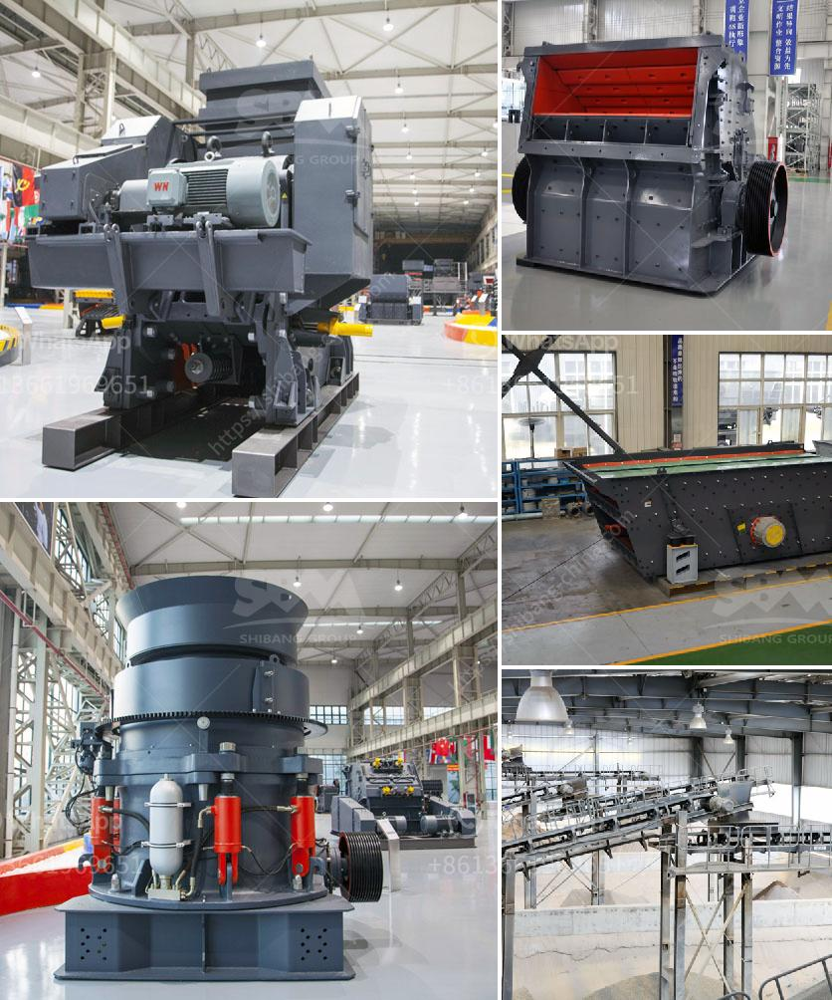

<h3>horizontally ball mill</h3>
The horizontal ball mill is a versatile and efficient machine for grinding and blending materials in preparation for mineral liberation processes. It is also used for the reduction of abrasives, ceramics, chemicals, and paints.

The most significant advantage of the horizontal ball mill lies in its adaptability to a wide range of materials. With its simplicity and ease of operation, the horizontal ball mill allows for quick and easy changes to the grinding media, mill lining, and diaphragm configuration.

Another advantage is its low maintenance and energy consumption requirements. The horizontal ball mill is designed with dual bearings on its main shaft for reduced power consumption, increased running stability, and longer service life.

Furthermore, the machine is lightweight, compact, and easy to operate, making it an ideal choice for small and medium-sized production plants. It can be used in both batch and continuous grinding processes, providing greater flexibility for manufacturers.

The horizontal ball mill is widely used in cement, silicate products, new building materials, refractory materials, fertilizer, ore dressing of black and non-ferrous metals and glass ceramics and other production industries of all kinds of ores and other grind-able materials.

Its application range is extensive, allowing it to handle both dry and wet grinding processes. In addition to traditional materials like limestone, clay, and gypsum, the horizontal ball mill can also handle more specialized materials such as coal, fly ash, and slag.

In conclusion, the horizontal ball mill is an efficient and versatile machine that offers a wide range of benefits. It is suitable for a variety of materials, with low energy consumption, easy operation, and maintenance. Its adaptability makes it an essential tool for manufacturers in various industries. Whether used for cement, ceramics, or chemical grinding, the horizontal ball mill is a reliable and cost-effective solution.
<h3>Contact us</h3><ul><li><strong>Whatsapp:&nbsp;<a href="https://wa.me/8613661969651">+8613661969651</a></strong></li><li><a href="https://swt.shibang-china.com/?git&amp;zhl&amp;horizontally ball mill"><strong>Online Service(chat now)</strong></a></li></ul><h3>Related</h3><ul><li><a href='jaw crusher engine and complete set.md'>jaw crusher engine and complete set</a></li><li><a href='mobile crusher 100tph.md'>mobile crusher 100tph</a></li><li><a href='river sand and stone mining at sabah.md'>river sand and stone mining at sabah</a></li><li><a href='crushing plant price list.md'>crushing plant price list</a></li><li><a href='cost of grinder machine mining crusher.md'>cost of grinder machine mining crusher</a></li></ul>