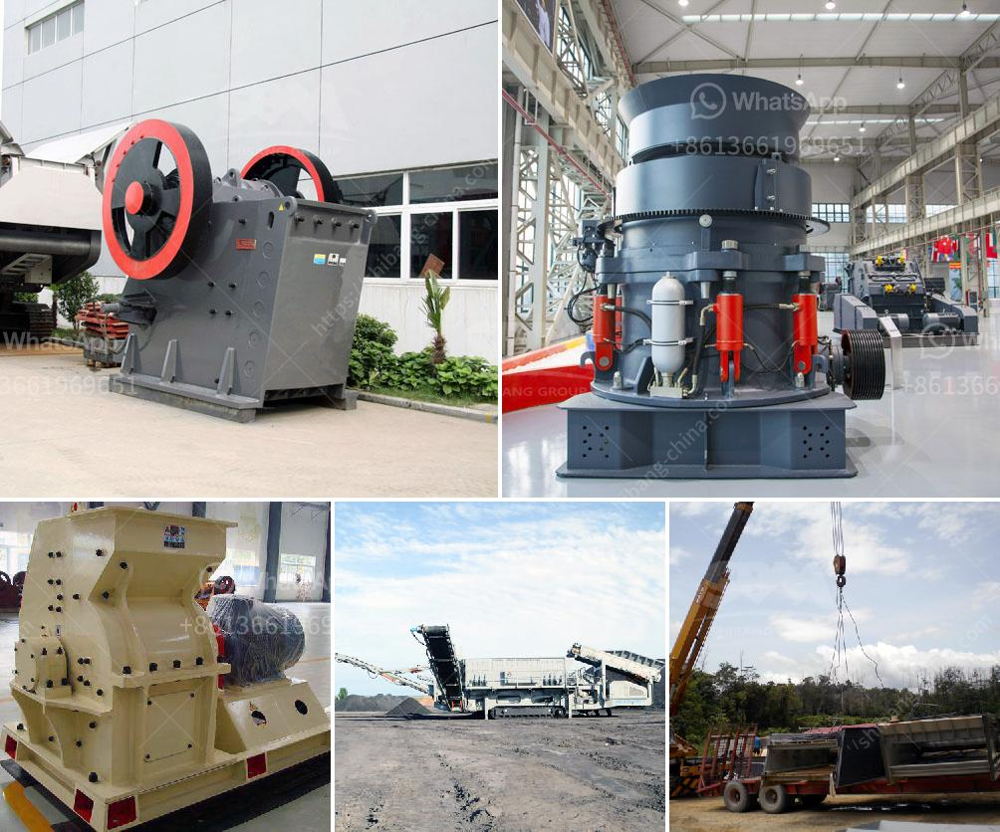

<h3>how many cost in crusher plant in pakistan</h3>
Crushing plants are a crucial part of mining operations in Pakistan, where the majority of minerals are mined. Many stone crushers, especially those operating in the mountainous regions of Pakistan, suffer from various respiratory ailments due to dust exposure. In order to alleviate risks these ailments, substantial preventative measures must be taken to protect workers in the industry. 

However, implementing these measures can be costly and often prevents smaller companies from investing in necessary equipment. The cost of setting up a crusher plant in Pakistan can be quite low when compared to other developing countries. This is primarily due to the fact that Pakistan possesses a vast amount of mineral resources including coal, copper, gold, limestone, and salt, among others. Many of these resources are located near the excavating sites, making transportation costs relatively low.

Additionally, government regulations in Pakistan are relatively lenient compared to neighboring countries. This has allowed many local entrepreneurs to venture into the stone-crushing business. As a result, there is a wide range of crusher plants that are efficiently operating in Pakistan.

One crusher plant in particular, the iconic Margalla Hills, has been repeatedly implicated in causing respiratory ailments to the surrounding communities. Local environmentalists and activists have long called for strict regulations and enforcement to mitigate the negative impacts of these operations. However, implementing such measures can increase the overall cost of setting up and running a crusher plant.

To strike a balance between protecting the environment and ensuring the economic viability of the stone-crushing industry, it is imperative to strike a balance. The government can support the development of more efficient crusher plants that incorporate technologies to minimize dust emissions or invest in dust suppression systems. This will help reduce respiratory health hazards for workers and the surrounding communities.

In conclusion, the cost of setting up a crusher plant in Pakistan varies depending on the type of stone crusher plant involved in the project. Besides, costs also vary depending on the investment required to establish a crusher plant and the overall infrastructure in the vicinity of the project. So, it is worthwhile to analyze the project-specific costs before embarking on the venture to ensure profitability and sustainability.
<h3>Contact us</h3><ul><li><strong>Whatsapp:&nbsp;<a href="https://wa.me/8613661969651">+8613661969651</a></strong></li><li><a href="https://swt.shibang-china.com/?git&amp;zhl&amp;how many cost in crusher plant in pakistan"><strong>Online Service(chat now)</strong></a></li></ul><h3>Related</h3><ul><li><a href='limestone production process.md'>limestone production process</a></li><li><a href='limestone powder conveying system.md'>limestone powder conveying system</a></li><li><a href='bauxite crusher machine.md'>bauxite crusher machine</a></li><li><a href='jaw crusher plant price.md'>jaw crusher plant price</a></li><li><a href='tons per hour mobile crushers.md'>tons per hour mobile crushers</a></li></ul>