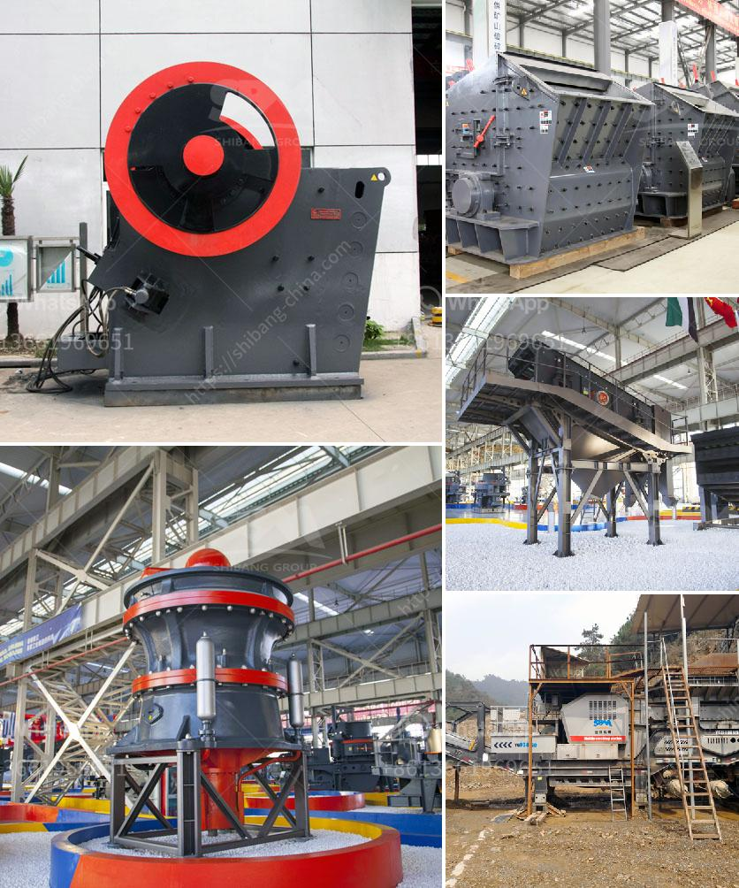

<h3>how much does a quarry machine cost</h3>
Quarrying is a lucrative industry, providing valuable raw materials to numerous industries around the world. Quarrying involves the extraction of rocks and other materials from the earth's surface or crust. The quarry machine is an important piece of equipment that plays a crucial role in the whole quarrying process. However, how much does a quarry machine cost?

The cost of a quarry machine mainly depends on the type of machine you need and the specific requirements for your quarrying project. As a leading global manufacturer of crushing, grinding, and mining equipment, Zenith can provide you with various quarrying machines, including crushers, grinding mills, feeders, screeners, and conveyors.

One of the factors that will affect the cost of a quarry machine is the capacity or throughput. For example, a small quarry may require a machine with a capacity of 50-100 tons per hour, while a large quarry may need a machine with a capacity of 500-1000+ tons per hour. Therefore, the cost will vary depending on the machine's capacity.

Another factor that influences the cost is the type of quarry machine you choose. Different machines have different prices due to their design, features, and functionality. Crushers, for example, come in different types such as jaw crushers, cone crushers, impact crushers, and vertical shaft impact crushers. Each type caters to specific quarrying needs and has a different price range.

In addition to the initial acquisition cost, you also need to consider the maintenance and operational costs associated with a quarry machine. This includes regular servicing, replacement of parts, fuel consumption, and electricity consumption. It is important to factor in these costs to calculate the total cost of owning and operating a quarry machine.

Furthermore, geographical location can also impact the cost of a quarry machine. Transporting heavy machinery can be expensive, especially if you are located far away from the manufacturer or supplier. Therefore, it is advisable to choose a machine supplier nearby in order to minimize transportation costs.

Lastly, it is crucial to conduct thorough research and compare prices from different suppliers before making a purchase decision. Prices can vary significantly depending on the brand, quality, and additional features included in the machine. Take time to analyze your specific quarrying needs and budget to find the most cost-effective option.

In conclusion, the cost of a quarry machine is influenced by several factors including capacity, type, maintenance, operational costs, geographical location, and supplier. It is important to consider all these factors and conduct thorough research to find the most cost-effective option for your quarrying project. With the right machine, you can optimize your quarrying operations and maximize profits.
<h3>Contact us</h3><ul><li><strong>Whatsapp:&nbsp;<a href="https://wa.me/8613661969651">+8613661969651</a></strong></li><li><a href="https://swt.shibang-china.com/?git&amp;zhl&amp;how much does a quarry machine cost"><strong>Online Service(chat now)</strong></a></li></ul><h3>Related</h3><ul><li><a href='silica quartz grinding plants bangalore.md'>silica quartz grinding plants bangalore</a></li><li><a href='central crushing granite.md'>central crushing granite</a></li><li><a href='pebble crushing production line.md'>pebble crushing production line</a></li><li><a href='crusher for sale peru.md'>crusher for sale peru</a></li><li><a href='silica sand manufacturing plant.md'>silica sand manufacturing plant</a></li></ul>