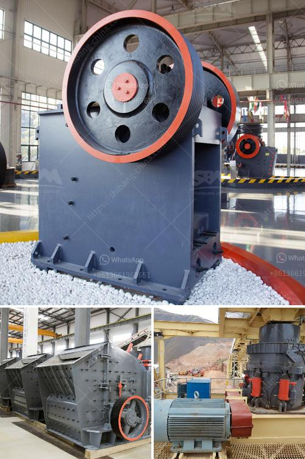

<h3>how much is a ball mill</h3>
A ball mill is a necessary appliance for mixing and pulverizing chemicals and compounds. With thousands of models and configurations available on the market, it can be quite daunting to find the perfect ball mill for your laboratory or manufacturing needs. In this article, we will explore the various factors that determine the price of a ball mill.

First and foremost, the size of the ball mill is a crucial factor. Ball mills come in various sizes, ranging from small tabletop versions to large industrial-scale models. Naturally, larger ball mills tend to have a higher price tag due to their increased capacity and durability. The size of the ball mill you require depends on factors such as the type of materials you plan to pulverize, the desired throughput, and the available space in your facility.

Another significant factor influencing the cost of a ball mill is the material it is made of. Ball mills are commonly constructed from materials such as steel, stainless steel, rubber, or ceramics. Each material has its own advantages and disadvantages, affecting both the price and performance of the ball mill. For example, steel ball mills are the most durable and robust, but they can also be the most expensive. On the other hand, rubber ball mills are more affordable and suitable for certain applications, but they may not be as long-lasting as steel mills.

Moreover, the ball mill's operational features also play a role in determining its price. Some ball mills are manually operated, allowing for more precise control over the milling process, while others are automated or equipped with digital controls for easier operation. Additionally, some ball mills come with additional features such as cooling systems, programmable timers, or variable speed settings, all of which contribute to an increase in cost. These advanced features may not be necessary for every application, so it's important to consider your specific needs before investing in a high-end ball mill.

Lastly, the brand reputation and customer support provided by the manufacturer can impact the price of a ball mill. Well-known brands with a strong track record in the industry tend to command higher prices due to their established reputation for quality and reliability. In contrast, lesser-known brands may offer more competitive prices but might lack the same level of customer support or product warranties.

In conclusion, the price of a ball mill can vary significantly depending on several factors. The size, material, operational features, and brand reputation are among the main considerations when determining the cost of a ball mill. It is essential to carefully evaluate your specific requirements, budget, and long-term goals before making a purchase to ensure that you invest in a ball mill that will meet your needs and deliver optimal performance.
<h3>Contact us</h3><ul><li><strong>Whatsapp:&nbsp;<a href="https://wa.me/8613661969651">+8613661969651</a></strong></li><li><a href="https://swt.shibang-china.com/?git&amp;zhl&amp;how much is a ball mill"><strong>Online Service(chat now)</strong></a></li></ul><h3>Related</h3><ul><li><a href='equipment use in the mining of laterite.md'>equipment use in the mining of laterite</a></li><li><a href='mini cement plant for sale in south africa.md'>mini cement plant for sale in south africa</a></li><li><a href='project report clinker grinding.md'>project report clinker grinding</a></li><li><a href='gypsum processing line.md'>gypsum processing line</a></li><li><a href='calcium carbonate machinery.md'>calcium carbonate machinery</a></li></ul>