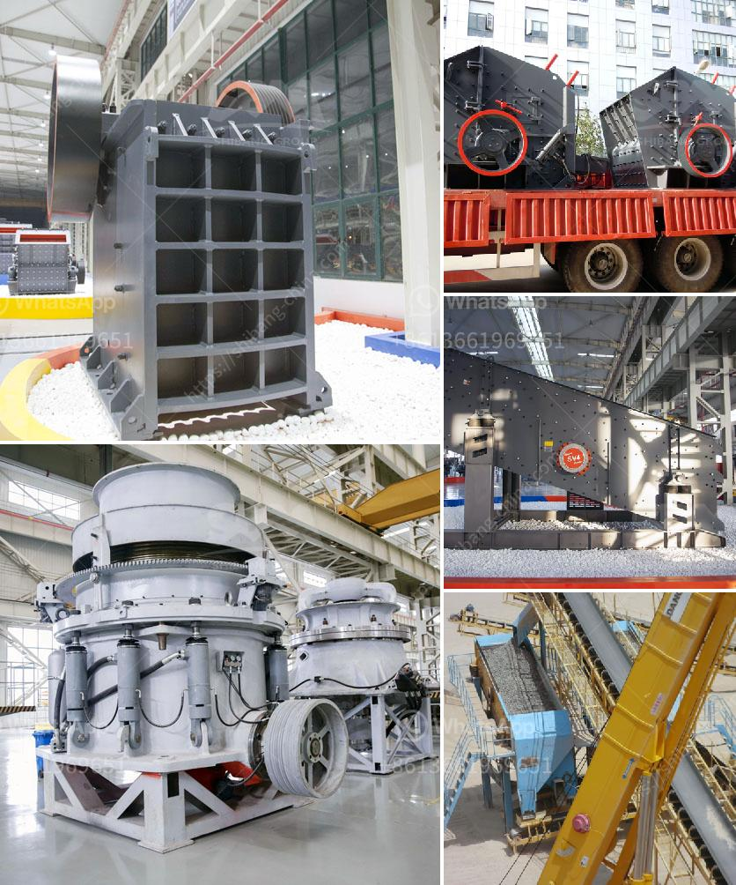

<h3>how much is crusher for gypsum</h3>
The demand for gypsum, a widely used material in the construction industry, is ever-increasing. This is due to its versatility and exceptional properties, such as its fire resistance and high strength. To extract gypsum from mines or quarries, a crusher is utilized. The cost of a crusher for gypsum ranges from several thousand dollars to millions of dollars, depending on its capacity, model, and features. In this article, we will explore the factors that determine the price of a crusher for gypsum.

Firstly, the capacity of the crusher plays a significant role in determining its cost. A crusher with higher capacity and efficiency will generally cost more due to its enhanced operation. For instance, a crusher with a capacity of 200 tons per hour would be more expensive than a crusher with a capacity of 100 tons per hour.

Secondly, the model and features of the crusher also impact its price. Crushers with advanced features and technologies tend to be priced higher. For instance, a crusher equipped with automation systems, adjustable settings, and a robust motor will carry a premium price compared to a basic crusher model.

Another aspect to consider is the cost of installation and maintenance. Some crushers require specialized installation, which may increase the overall cost. Additionally, crushers with complex mechanisms or parts may require more frequent maintenance and replacement, resulting in higher operational costs over time.

Lastly, market conditions and supplier pricing strategies contribute to the variability in gypsum crusher prices. Factors such as supply and demand, transportation costs, and competition among suppliers can affect the final price of the crusher.

In conclusion, the cost of a crusher for gypsum can vary greatly depending on its capacity, model, features, installation, and market conditions. As a prospective buyer, it is essential to research and compare different crushers to find one that meets your requirements and budget.
<h3>Contact us</h3><ul><li><strong>Whatsapp:&nbsp;<a href="https://wa.me/8613661969651">+8613661969651</a></strong></li><li><a href="https://swt.shibang-china.com/?git&amp;zhl&amp;how much is crusher for gypsum"><strong>Online Service(chat now)</strong></a></li></ul><h3>Related</h3><ul><li><a href='crusher machine price in pakistan.md'>crusher machine price in pakistan</a></li><li><a href='ball mill for limestone grinding power calculation.md'>ball mill for limestone grinding power calculation</a></li><li><a href='canada gold mining equipment manufacturers.md'>canada gold mining equipment manufacturers</a></li><li><a href='brick stone crusher machine.md'>brick stone crusher machine</a></li><li><a href='cost of setting up cement plant in south africa.md'>cost of setting up cement plant in south africa</a></li></ul>