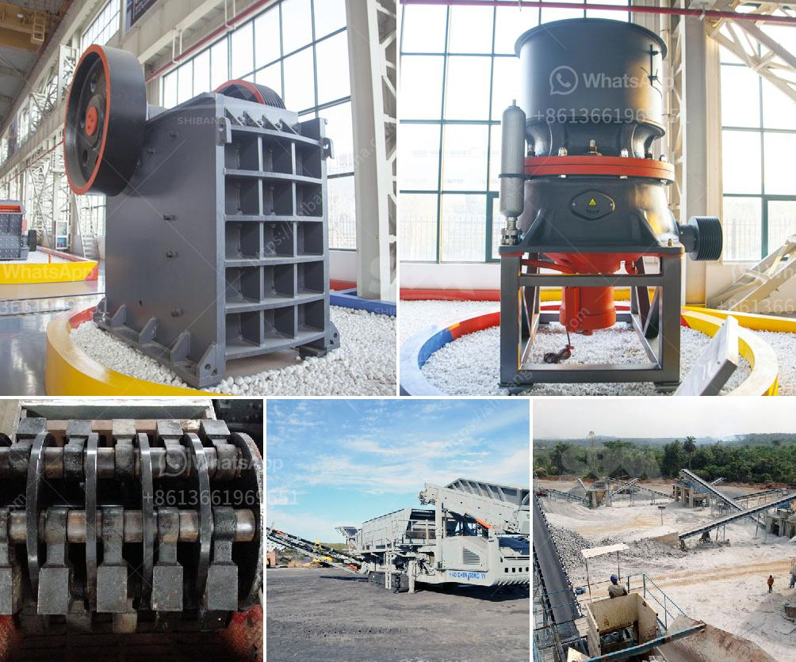

<h3>how much is mobile crusher rock</h3>
Mobile crushers for rocks have gained immense popularity in recent years due to their versatility, convenience, and efficiency. These crushers are specifically designed to crush stones and rocks of various sizes, making them ideal for construction and mining projects. If you are considering investing in a mobile crusher for your business, it is important to understand the factors that determine its price.

One of the primary factors that influence the cost of a mobile crusher is its capacity. The capacity of a crusher is measured in tons per hour and refers to the maximum amount of material that the crusher can process in a given period. Generally, a crusher with a higher capacity has a higher price.

Another significant factor is the type and model of the mobile crusher. There are various types of crushers available in the market, including jaw crushers, impact crushers, cone crushers, and more. The price of a mobile crusher will depend on the specific features and capabilities of the chosen model.

Additionally, the brand and reputation of the manufacturer can impact the price. Well-known and established manufacturers often charge a higher price due to their reputation for producing high-quality and durable crushers. However, it is important to carefully research and compare different manufacturers to ensure you are getting the best value for your money.

Lastly, the condition and age of the mobile crusher can affect its price. Brand new crushers will generally be more expensive compared to used ones. However, when purchasing a used crusher, it is essential to thoroughly inspect it to ensure it is in good working condition and has been well-maintained.

In conclusion, the price of a mobile crusher for rocks can vary depending on several factors, including capacity, type and model, manufacturer, and condition. It is essential to consider these factors and conduct thorough research before making a purchase to ensure you are getting the best deal. Investing in a mobile crusher can greatly enhance your business's productivity and efficiency, making it a worthwhile investment in the long run.
<h3>Contact us</h3><ul><li><strong>Whatsapp:&nbsp;<a href="https://wa.me/8613661969651">+8613661969651</a></strong></li><li><a href="https://swt.shibang-china.com/?git&amp;zhl&amp;how much is mobile crusher rock"><strong>Online Service(chat now)</strong></a></li></ul><h3>Related</h3><ul><li><a href='turkey dolomite crushing plant.md'>turkey dolomite crushing plant</a></li><li><a href='three quarter stone machine.md'>three quarter stone machine</a></li><li><a href='mobile crushing plant for limestone.md'>mobile crushing plant for limestone</a></li><li><a href='crusehr processing plant malaysia.md'>crusehr processing plant malaysia</a></li><li><a href='rotary hammer mills with dispenser.md'>rotary hammer mills with dispenser</a></li></ul>