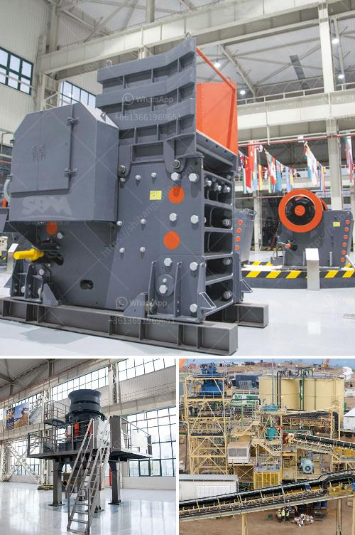

<h3>how pyrite mined and processed</h3>
Pyrite, also known as "fool's gold," is a fascinating mineral that has been utilized for various purposes throughout history. From being mistaken for gold and used as currency by ancient civilizations to its modern applications in manufacturing and even jewelry, the process of mining and processing pyrite has always played a crucial role in uncovering its hidden potential.

The first step in mining pyrite involves prospecting the earth's crust for potential pyrite deposits. Geologists study the geology and mineralogy of an area, looking for hints of pyrite-rich regions. These deposits are commonly found in sedimentary rock formations that were formed millions of years ago. Once a potential deposit is identified, a detailed analysis and assessment are conducted to determine its economic viability.

The actual mining of pyrite begins with the excavation of the deposit. This process can be done through open-pit mining or underground mining, depending on the depth and size of the deposit. Open-pit mining involves the extraction of pyrite from large pits on the surface of the earth, whereas underground mining involves tunneling and shafts to reach deeper pyrite reserves.

Once the pyrite is extracted, it undergoes a process called beneficiation. During beneficiation, the pyrite ore is crushed and ground into small particles, which helps to separate the valuable pyrite from the rest of the ore. The crushed ore is then subjected to a series of physical and chemical processes, such as flotation and magnetic separation, to separate the pyrite from other impurities. This allows for a higher concentration of pyrite in the final product.

After the beneficiation process, the pyrite concentrate is then further refined to remove any remaining impurities. This refining process may involve additional grinding, acid leaching, and roasting, depending on the specific requirements. The aim of this refining process is to obtain a pure, high-grade pyrite concentrate, ready for its various applications.

Pyrite finds its use in multiple industries due to its unique properties. In the field of manufacturing, pyrite is used in the production of sulfuric acid, which is widely employed in fertilizers, dyes, medicines, and numerous other chemicals. Additionally, pyrite is utilized in the production of pigments, such as iron oxide yellow, which is commonly used in paints and ceramics.

In recent years, pyrite has also gained popularity in the jewelry industry. Its metallic luster and golden color make it a distinctive alternative to traditional gemstones. Pyrite is often cut and polished into various shapes and sizes, creating stunning pieces of jewelry that mimic the appearance of gold, hence its "fool's gold" nickname.

While pyrite has many practical applications, it is important to note that exposure to pyrite dust can be hazardous. When pyrite-containing rocks are exposed to air and water, they can oxidize and form sulfuric acid, leading to acid mine drainage, which can be harmful to the environment. Proper safety measures should always be undertaken during the mining and processing of pyrite to mitigate such risks and ensure the protection of both workers and the surrounding ecosystems.

In conclusion, pyrite mining and processing are crucial steps in uncovering the hidden potential of this fascinating mineral. Through careful prospecting, mining, and processing techniques, pyrite is transformed into a valuable resource used in various industries. Its metallic properties and distinctive appearance make it a sought-after commodity, whether for its role in manufacturing or its unique place in jewelry. However, it is essential to prioritize safety and environmental considerations to mitigate any potential harm associated with pyrite mining and processing.
<h3>Contact us</h3><ul><li><strong>Whatsapp:&nbsp;<a href="https://wa.me/8613661969651">+8613661969651</a></strong></li><li><a href="https://swt.shibang-china.com/?git&amp;zhl&amp;how pyrite mined and processed"><strong>Online Service(chat now)</strong></a></li></ul><h3>Related</h3><ul><li><a href='malaysia companies that manufacture crushing machines.md'>malaysia companies that manufacture crushing machines</a></li><li><a href='portable jaw crusher plant.md'>portable jaw crusher plant</a></li><li><a href='mining crusher machine.md'>mining crusher machine</a></li><li><a href='gold mining compressor price in south africa.md'>gold mining compressor price in south africa</a></li><li><a href='gravel crusher machinery.md'>gravel crusher machinery</a></li></ul>