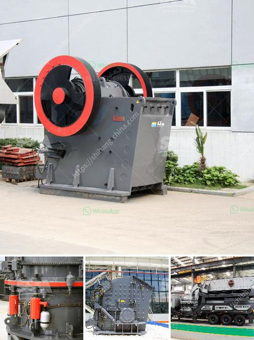

<h3>how to align to horizontal ball mill</h3>
A ball mill is a critical equipment in the production of any mineral material. In order to ensure its efficient operation, the necessity of regular maintenance and alignment cannot be emphasized enough. All equipment experiences wear and tear, but by implementing a regular maintenance plan, costly breakdowns can be avoided, and the longevity of your ball mill can be significantly extended.

One of the crucial steps in maintaining a horizontal ball mill is to align its components properly. Alignment ensures all parts are correctly positioned, minimizing excessive vibrations and maximizing the mill's efficiency. The following steps outline a practical approach to aligning a horizontal ball mill:

1. Remove Obstructions: Before starting the alignment process, it is essential to ensure that no foreign objects or debris are obstructing the mill's rotation. Move any impediments out of the way to allow for a clear alignment process.

2. Clear the Base and Foundation: The mill's base and foundation must be free from any dirt, dust, or debris. Clean the surfaces thoroughly, ensuring there are no loose materials that could affect the alignment.

3. Verify Levelness: Ensure that the mill's base and foundation are properly leveled. Use a spirit level to check its horizontal and vertical position. Correct any discrepancies, as an uneven base or foundation will result in misalignment and poor operation.

4. Check Gear Alignment: The gear alignment is crucial for a horizontal ball mill's operation. Inspect the gears for any signs of damage, wear, or misalignment. Repair or replace damaged gears promptly to avoid further complications. It is recommended to enlist the services of a professional if complex repairs are needed.

5. Align the Motor and Pinion: The motor and pinion should be aligned to ensure smooth and efficient power transmission. Check the alignment by measuring the gap between the pinion and the adjacent gear. If necessary, adjust the motor's location, shims, or couplings to achieve proper alignment.

6. Alignment of Supporting Rollers: The supporting rollers play a vital role in the forward and backward movement of the mill. Inspect the roller bearings and ensure they are properly lubricated. Align the rollers to prevent excessive strain on the mill's structure.

7. Confirm Alignment: After performing all the necessary adjustments, recheck the alignment of all components. Inspect and measure critical dimensions to ensure optimal alignment. Rotate the mill manually to verify smooth rotation without any binding or excessive vibrations.

8. Maintain Proper Lubrication: Finally, ensure that all moving components are adequately lubricated. Regularly check lubrication levels and replenish as needed. Proper lubrication significantly improves equipment performance and reduces wear.

By adhering to these alignment steps, you can effectively maintain and optimize the performance of your horizontal ball mill. Remember that alignment is an ongoing process and should be included in your regular maintenance routine. Invest the time and effort into proper alignment to prolong your equipment's lifespan, reduce downtime, and achieve maximum efficiency in your mineral material production.
<h3>Contact us</h3><ul><li><strong>Whatsapp:&nbsp;<a href="https://wa.me/8613661969651">+8613661969651</a></strong></li><li><a href="https://swt.shibang-china.com/?git&amp;zhl&amp;how to align to horizontal ball mill"><strong>Online Service(chat now)</strong></a></li></ul><h3>Related</h3><ul><li><a href='jual grinding mill hammer mill philippines.md'>jual grinding mill hammer mill philippines</a></li><li><a href='mini crusher for gravel.md'>mini crusher for gravel</a></li><li><a href='gypsum ball mill manufacturing machine.md'>gypsum ball mill manufacturing machine</a></li><li><a href='powder making machines.md'>powder making machines</a></li><li><a href='grinding media balls suppliers in south africa.md'>grinding media balls suppliers in south africa</a></li></ul>