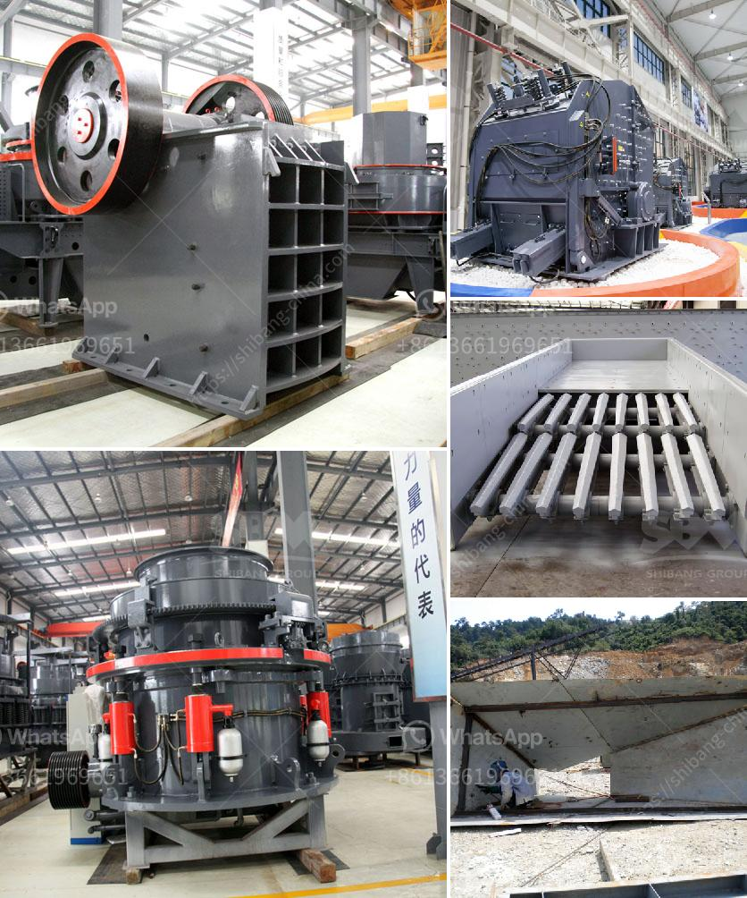

<h3>how to build a manganese beneficiation plant</h3>
Manganese ore is a valuable mineral resource that is used in various industries such as metallurgy, electronics, and manufacturing. To fully utilize this resource, it is necessary to establish a manganese beneficiation plant. This article will discuss the steps involved in building a manganese beneficiation plant.

The first step in building a manganese beneficiation plant is to identify suitable locations that have access to manganese ore deposits. These locations can be near mines or in areas where manganese ore is abundant. It is essential to ensure that the chosen location has sufficient infrastructure, such as roads, electricity, and water supply, to support the plant's operations.

Once the location is finalized, the next step is to conduct detailed feasibility studies. These studies determine the economic viability of establishing a manganese beneficiation plant in the chosen location. Feasibility studies involve assessing various factors such as the quality and quantity of manganese ore deposits, market demand, production costs, and potential revenue streams. The outcome of these studies will determine whether the project is financially feasible.

After completing the feasibility studies, the next crucial step is to acquire the necessary permits and licenses to establish the manganese beneficiation plant. These permits and licenses are obtained from the relevant government authorities responsible for regulating mining and mineral processing activities. Compliance with environmental regulations is particularly crucial to minimize the plant's impact on the surrounding ecosystem.

Once the required permits and licenses are obtained, the construction of the manganese beneficiation plant can begin. This involves several stages, including site preparation, equipment installation, and infrastructure development. The plant should be designed to handle the expected production capacity and meet the required quality standards. It should include crushing, screening, washing, and other processes to remove impurities and upgrade the manganese ore.

In addition to the physical infrastructure, it is essential to have a skilled workforce to operate the manganese beneficiation plant efficiently. Training programs should be conducted to familiarize the employees with the plant's operations, safety measures, and quality control procedures. Moreover, an effective management system should be established to ensure smooth operations and minimize downtime.

Once the construction is complete, the manganese beneficiation plant can start its operations. The plant's output can be sold to various industries that require manganese ore. It is important to establish relationships with potential buyers and secure long-term contracts to ensure a stable market for the plant's output.

As the plant operates, regular monitoring and maintenance should be carried out to ensure optimal performance. Quality control processes should be implemented to maintain the desired product specifications. Additionally, ongoing research and development efforts should be undertaken to improve the plant's efficiency and find innovative ways to extract and process manganese ore.

In conclusion, the establishment of a manganese beneficiation plant involves several crucial steps, including site selection, feasibility studies, permit acquisition, construction, and operation. Building a manganese beneficiation plant requires careful planning, adequate financing, and adherence to regulatory requirements. With the right resources, expertise, and dedication, the plant can contribute to the utilization of manganese ore and the growth of various industries that rely on this valuable mineral resource.
<h3>Contact us</h3><ul><li><strong>Whatsapp:&nbsp;<a href="https://wa.me/8613661969651">+8613661969651</a></strong></li><li><a href="https://swt.shibang-china.com/?git&amp;zhl&amp;how to build a manganese beneficiation plant"><strong>Online Service(chat now)</strong></a></li></ul><h3>Related</h3><ul><li><a href='sand washing screener florida.md'>sand washing screener florida</a></li><li><a href='small ballast making machine for sale kenya.md'>small ballast making machine for sale kenya</a></li><li><a href='aggregate stone crusher price south africa.md'>aggregate stone crusher price south africa</a></li><li><a href='gold processing per hour.md'>gold processing per hour</a></li><li><a href='vibrating screen specification pdf.md'>vibrating screen specification pdf</a></li></ul>