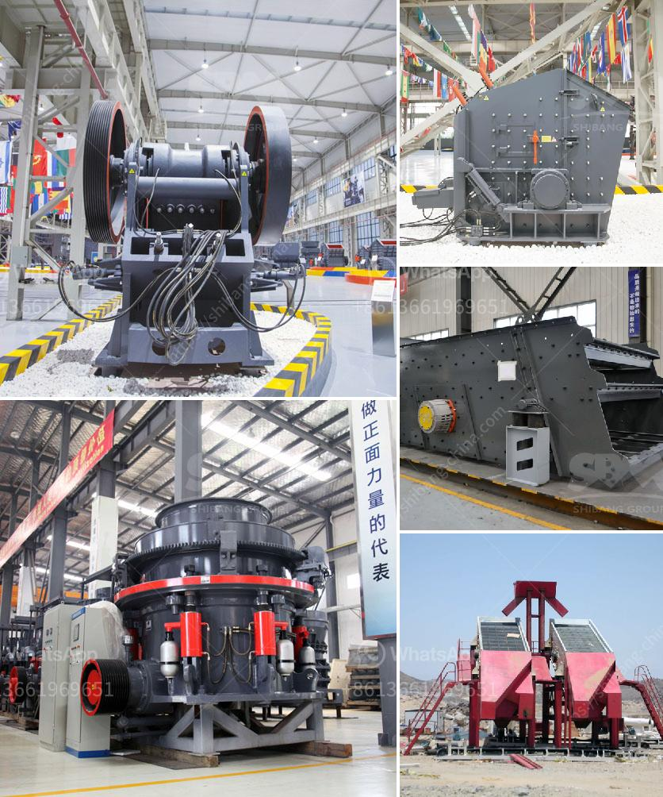

<h3>how to buy brick crushing machine from bangladesh</h3>
If you are in the construction industry or involved in a project that requires brick crushing machines, purchasing one from Bangladesh can be a cost-effective solution. Bangladesh is emerging as a hub for reliable and affordable machinery, and buying a brick crushing machine from this country can provide a range of benefits. Here are some steps to consider when looking to buy a brick crushing machine from Bangladesh.

1. Research and Gather Information: Start by conducting thorough research on different brick crushing machine manufacturers and suppliers in Bangladesh. Look for companies that have a reputation for producing high-quality machinery at competitive prices. Check their website, read customer reviews, and gather information about their experience in the industry.

2. Identify Your Requirements: Assess your project requirements and determine the type and capacity of brick crushing machine you need. Consider factors such as the volume of bricks to be crushed, power source options (electricity or engine), and mobility requirements (stationary or mobile). This will help you narrow down your options and make an informed decision.

3. Contact Manufacturers and Suppliers: Reach out to the shortlisted manufacturers and suppliers, and request product catalogs, specifications, and pricing details. Engage in discussions to clarify any doubts or questions you may have. Ask about warranty options, after-sales services, spare parts availability, and shipping arrangements.

4. Compare Quotes and Negotiate: Once you have several quotes from different manufacturers, compare them to ensure you are getting the best value for your money. Consider the overall package, including the quality of the machine, warranty, and other services. Don't hesitate to negotiate on the price and other terms if needed.

5. Verify Credentials and Make a Purchase: Before finalizing the purchase, verify the credentials and reliability of the chosen manufacturer or supplier. Check their reputation, certifications, and customer feedback. Conduct the necessary due diligence to ensure a smooth and secure transaction.

6. Arrange Shipping and Delivery: Coordinate with the seller to arrange shipping and delivery of the brick crushing machine. Check if they can provide assistance with customs clearance, shipping documents, and logistics. Ensure that the machine is safely packaged for transportation to Bangladesh.

By following these guidelines, you can navigate the process of buying a brick crushing machine from Bangladesh. Not only will you benefit from the affordability and reliability of machinery from this country, but you will also contribute to its growing manufacturing industry.
<h3>Contact us</h3><ul><li><strong>Whatsapp:&nbsp;<a href="https://wa.me/8613661969651">+8613661969651</a></strong></li><li><a href="https://swt.shibang-china.com/?git&amp;zhl&amp;how to buy brick crushing machine from bangladesh"><strong>Online Service(chat now)</strong></a></li></ul><h3>Related</h3><ul><li><a href='tph rock crusher.md'>tph rock crusher</a></li><li><a href='price hammer crusher in nigeria.md'>price hammer crusher in nigeria</a></li><li><a href='famous manganese cone crusher parts made in luoyang china.md'>famous manganese cone crusher parts made in luoyang china</a></li><li><a href='business plan for small scale chrome mining crusher.md'>business plan for small scale chrome mining crusher</a></li><li><a href='machine price list ball mill for silica sand.md'>machine price list ball mill for silica sand</a></li></ul>