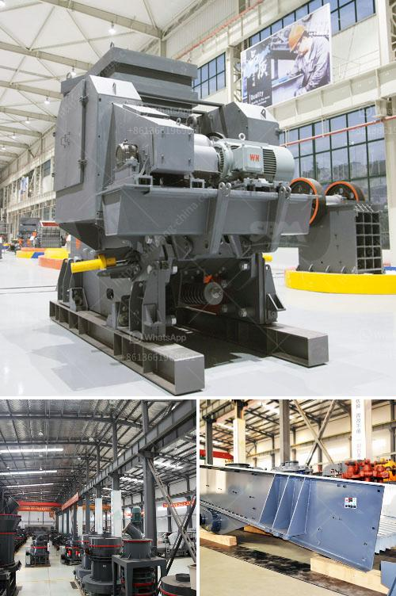

<h3>how to calculate cost per ton crusher aggregate</h3>
Calculating the cost per ton of aggregate is an important aspect of any crushing operation as it directly impacts the efficiency and profitability of your business. It is important to accurately estimate the costs associated with crushing and screening the material to ensure you get the maximum return on investment.

To calculate the cost per ton crusher aggregate, you need to determine the operating costs of your crushing operation. There are several factors that will affect the cost, including:

1. Equipment: Consider the cost of purchasing and maintaining crushing equipment, including labor expenses, fuel consumption, and equipment depreciation.

2. Production Rate: Determine the amount of material you can produce per hour or per day. This will depend on the capacity of your crusher and the efficiency of your screening equipment.

3. Labor Costs: Calculate the labor costs associated with operating the crushing equipment, including the number of employees required and their hourly wages.

4. Site Logistics: Consider the costs of transporting the material to and from the crushing site. This will include costs for trucks, fuel, and transportation time.

With these factors in mind, you can calculate the cost per ton crusher aggregate by dividing the total costs by the total tons of material produced.

For example, let's assume your crushing operation produces 50,000 tons of aggregate a year. The total costs for operating the equipment, labor, and site logistics amount to $400,000. The cost per ton crusher aggregate can be calculated as follows:

By accurately estimating the cost per ton, you can make informed decisions about your crushing operation, such as optimizing equipment usage, streamlining productivity, and maximizing profitability. Regularly reviewing and adjusting your calculations will help you stay competitive in the industry and ensure long-term success.
<h3>Contact us</h3><ul><li><strong>Whatsapp:&nbsp;<a href="https://wa.me/8613661969651">+8613661969651</a></strong></li><li><a href="https://swt.shibang-china.com/?git&amp;zhl&amp;how to calculate cost per ton crusher aggregate"><strong>Online Service(chat now)</strong></a></li></ul><h3>Related</h3><ul><li><a href='chromite processing plant equipment for pakistan.md'>chromite processing plant equipment for pakistan</a></li><li><a href='small scale gold processing line.md'>small scale gold processing line</a></li><li><a href='coal vibration equipment size.md'>coal vibration equipment size</a></li><li><a href='cone crushers made in italy.md'>cone crushers made in italy</a></li><li><a href='limestone belt conveyor.md'>limestone belt conveyor</a></li></ul>