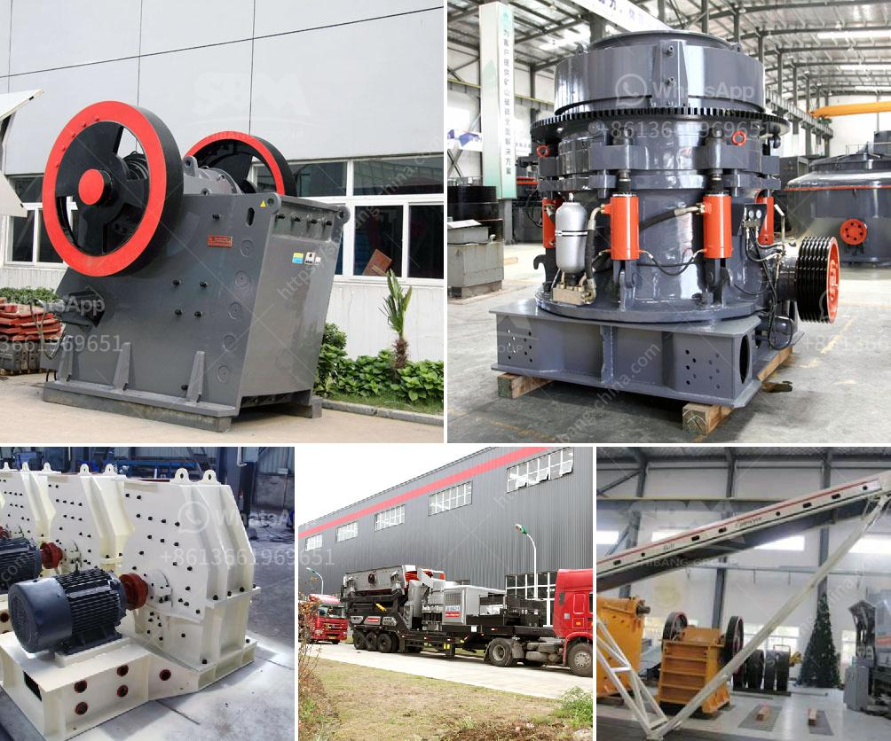

<h3>how to calculate the powder conveying rate</h3>
Powder conveying rate is a crucial aspect in various industries, especially those involved in manufacturing and processing. It refers to the amount of powder material that can be transported from one point to another within a given time frame. Calculating this rate accurately is essential for optimizing production efficiency and ensuring smooth operations. In this article, we will outline a step-by-step guide on how to calculate the powder conveying rate.

Firstly, it is important to determine the bulk density of the powder material. Bulk density represents the weight of a given volume of powder and is usually expressed in kilograms per cubic meter (kg/m3). This information can be obtained from the material's data sheet or by conducting laboratory tests.

Next, measure the volumetric flow rate of the powder material. This can be done by either directly measuring the actual flow rate or calculating it based on the conveyer system's design parameters. If you have a continuous conveying system, the volumetric flow rate can be determined by measuring the cross-sectional area of the conveyer and the average linear velocity.

Once you have the bulk density and volumetric flow rate, calculating the powder conveying rate is straightforward. Multiply the volumetric flow rate by the bulk density to obtain the mass flow rate. The mass flow rate is typically expressed in kilograms per hour (kg/h). This calculation provides you with the amount of powder material that is being conveyed per unit of time.

It is worth noting that the powder conveying rate can vary depending on factors such as conveying distance, equipment efficiency, and the characteristics of the powder material itself. Therefore, it is essential to regularly monitor and adjust the conveying rate to meet specific production requirements.

In conclusion, accurately calculating the powder conveying rate is essential for maintaining optimal production efficiency and ensuring smooth operations in various industries. By determining the bulk density and volumetric flow rate, one can easily derive the mass flow rate, which represents the amount of powder material being conveyed per unit of time. Regular monitoring and adjustments are necessary to account for variations in conveying distance, equipment efficiency, and material characteristics.
<h3>Contact us</h3><ul><li><strong>Whatsapp:&nbsp;<a href="https://wa.me/8613661969651">+8613661969651</a></strong></li><li><a href="https://swt.shibang-china.com/?git&amp;zhl&amp;how to calculate the powder conveying rate"><strong>Online Service(chat now)</strong></a></li></ul><h3>Related</h3><ul><li><a href='cost of cement grinding unit in india.md'>cost of cement grinding unit in india</a></li><li><a href='cost of mini pulvrizers crusher.md'>cost of mini pulvrizers crusher</a></li><li><a href='raymond grinding mill manufacturers in udaipur.md'>raymond grinding mill manufacturers in udaipur</a></li><li><a href='mobile rock crusher granulator jaw type ballitoville.md'>mobile rock crusher granulator jaw type ballitoville</a></li><li><a href='processing of limestone and crushing.md'>processing of limestone and crushing</a></li></ul>