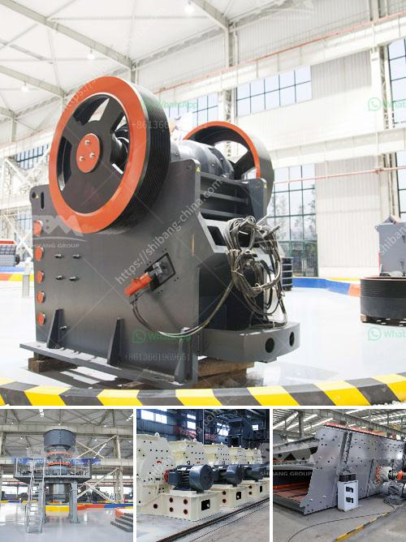

<h3>how to charge grinding media in ball mill</h3>
Ball mills are widely used in the grinding process for various ore materials, including cement, limestone, coal, iron ore, and ceramic materials. Due to the different nature of the ore, the grinding media required by the grinding process is also different. In the actual production process, operators need to continuously adjust the grinding media charging conditions according to the production conditions. This article will introduce how to charge grinding media in ball mills.

The feed size of the ball mill determines the suitable grinding media size. Generally, the feed size should be less than 10mm. In the fine grinding stage, the grinding media size should be in the range of 5-8mm. The grinding medium size in the coarse grinding stage should be in the range of 40-60mm.

The grinding media quantity can be calculated based on the volume of the ball mill liner. The filling degree of the mill liner can be calculated as a percentage of the total mill volume. For example, if the total mill volume is 1000 liters and the liner volume is 400 liters, the filling degree is 40%.

Different grinding media have different grinding efficiencies. The proportions of various grinding media in the ball mill should be determined reasonably, including the size ratio, relative density, and charge ratio of grinding balls. The size of grinding media directly affects the grinding efficiency and product fineness. The larger the diameter of grinding balls, the lower the specific surface area, so the better the grinding effect.

After determining the grinding media size and proportion, the grinding media charging starts from the coarse grinding stage. Generally, charging coarse grinding media first helps to achieve the coarse grinding effect earlier, thereby reducing the wear of fine grinding media and improving the grinding efficiency.

During the charging process, the grinding media should be gradually added to the ball mill according to their characteristics. The grinding media with larger diameters and higher densities should be added first and gradually replaced by smaller grinding media. This can improve the grinding efficiency and maintain a balanced ball mill load.

The filling degree of the ball mill can be measured using an electric scale or a steel ruler. Measuring the filling degree at regular intervals can help to achieve efficient grinding and determine the optimum charging condition.

In conclusion, charging grinding media in ball mills is a vital step in optimizing mill performance and ensuring efficient grinding. By considering the appropriate size, proportion, and charging method of grinding media, operators can improve the grinding efficiency and achieve the desired product fineness. Regular monitoring and adjustment of the grinding media charging conditions can further enhance the mill's productivity and prolong its service life.
<h3>Contact us</h3><ul><li><strong>Whatsapp:&nbsp;<a href="https://wa.me/8613661969651">+8613661969651</a></strong></li><li><a href="https://swt.shibang-china.com/?git&amp;zhl&amp;how to charge grinding media in ball mill"><strong>Online Service(chat now)</strong></a></li></ul><h3>Related</h3><ul><li><a href='price jaw crusher price stone crusher.md'>price jaw crusher price stone crusher</a></li><li><a href='size of ball mill with cspacity 280 tph.md'>size of ball mill with cspacity 280 tph</a></li><li><a href='second hand mobile coal washing plant.md'>second hand mobile coal washing plant</a></li><li><a href='price for vsi crusher.md'>price for vsi crusher</a></li><li><a href='feasibility study on barite milling plants.md'>feasibility study on barite milling plants</a></li></ul>