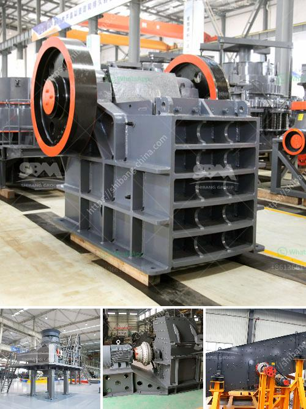

<h3>how to design iron ore plant</h3>
Iron ore plants are integral to the mining industry, as they are responsible for extracting and processing this vital mineral into a usable product. Effective design and engineering of iron ore plants ensure optimum efficiency and profitability during operation. In this article, we will explore the crucial factors to consider when designing an iron ore plant.

Firstly, it is essential to evaluate the geological characteristics of the ore deposit. This includes analyzing the ore's composition, grade, and variability. By understanding the quality and type of iron ore available, engineers can design the plant with appropriate processing equipment and infrastructure.

The next step in designing an iron ore plant is to determine the processing method. There are two main types: physical beneficiation and chemical extraction. Physical beneficiation involves crushing, grinding, and separating the ore into valuable and waste components. On the other hand, chemical extraction uses chemicals to leach the iron from the ore. Both methods have their pros and cons, and the choice depends on the specific characteristics of the ore deposit and the desired end product.

Size matters when it comes to plant design. The throughput capacity of the plant should be carefully calculated based on the expected demand and the mining operation's production rate. The plant should be designed to handle a sufficient volume of ore, ensuring a smooth and uninterrupted process flow. This requires consideration of equipment capacity, conveyor systems, storage facilities, and crushing and screening capabilities.

Efficient utilization of energy is another critical aspect in the design of an iron ore plant. Energy-intensive processes, such as crushing and grinding, consume a significant amount of power. Therefore, the plant's layout and equipment selection should focus on minimizing energy consumption while maintaining productivity. Incorporating energy-efficient technologies, such as using high-pressure grinding rolls instead of traditional grinding mills, can greatly reduce energy costs.

The plant's water management system is equally important. Water is an essential resource in iron ore processing, used for various purposes such as washing, screening, and cooling. A well-designed water management system ensures adequate supply and effective recycling to minimize water consumption and environmental impact. Additionally, implementing advanced water treatment technologies can help meet regulatory requirements and reduce the plant's overall water footprint.

Health, safety, and environmental considerations should be at the forefront of plant design. This involves meeting all applicable safety standards, ensuring proper ventilation, and implementing waste management practices. The design should also incorporate measures to mitigate dust emissions and noise pollution, as they can have adverse effects on both worker health and nearby communities.

Lastly, plant maintenance and future expansion plans should be carefully considered during the design process. An iron ore plant must be designed with ease of maintenance in mind to ensure continuous operation and minimize downtime. There should also be provisions for future expansion to accommodate increasing production demands.

In conclusion, designing an iron ore plant requires careful consideration of various factors, ranging from geological characteristics and processing methods to plant size, energy utilization, water management, and safety. By incorporating these crucial aspects into the design process, engineers can develop an efficient, cost-effective, and sustainable iron ore plant that drives profitability in the mining industry.
<h3>Contact us</h3><ul><li><strong>Whatsapp:&nbsp;<a href="https://wa.me/8613661969651">+8613661969651</a></strong></li><li><a href="https://swt.shibang-china.com/?git&amp;zhl&amp;how to design iron ore plant"><strong>Online Service(chat now)</strong></a></li></ul><h3>Related</h3><ul><li><a href='limestone jaw crusher sizes.md'>limestone jaw crusher sizes</a></li><li><a href='gypsum portland cement retarder manufacturer usa.md'>gypsum portland cement retarder manufacturer usa</a></li><li><a href='calcium bromide manufacturing process.md'>calcium bromide manufacturing process</a></li><li><a href='stone crusher price in australia.md'>stone crusher price in australia</a></li><li><a href='coal pulverizer machine price.md'>coal pulverizer machine price</a></li></ul>