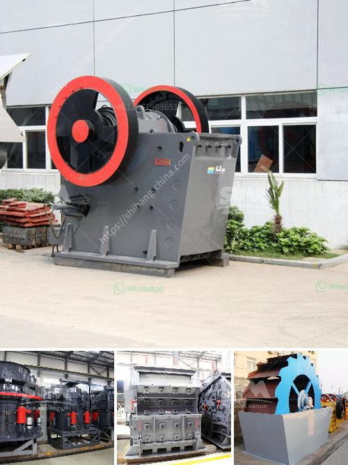

<h3>how to draw a stone crusher</h3>
In order to create a realistic portrayal of a stone crusher, you will need a few basic drawing supplies. Such materials include graphite pencils, erasers, paper, and a drawing surface. To begin, you will want to set up your drawing area with ample lighting and a comfortable space to work. Now, let's start the process of drawing a stone crusher, step-by-step.

Begin by drawing a rectangle shape for the base of the crusher. This rectangular shape will serve as the foundation for the entire structure. Then, lightly sketch a couple of vertical lines inside the rectangle to establish the crusher's height.

Next, add two diagonal lines extending from the top corners of the rectangle shape. This will determine the slope of the crusher's top. By drawing these lines at an angle, you will create a three-dimensional effect, adding depth to your drawing.

Now, let's move on to the crushing mechanism of the stone crusher. Draw a horizontal line across the center of the rectangle shape. From this line, sketch two straight, vertical lines, creating an upside-down "V" shape. This will serve as the jaws of the stone crusher.

Refine the shape of the jaws by drawing curved lines that connect the top and bottom corners of the "V" shape. These curves will give the jaws a more realistic appearance. Also, add a few smaller lines inside the jaws to indicate teeth.

Now that the main components are complete, it's time to outline the base structure of the stone crusher. Simply draw a second rectangle shape above the first one, maintaining the same width but reducing the height. Ensure that the corners of the top rectangle align with the outer edges of the bottom one.

To add detailing and embellishments, you can draw circles or curved lines on the sides of the base structure. These lines will serve as decorative touches or represent control panels, depending on your artistic vision.

Carefully erase any unnecessary construction lines that may distract from the final drawing. This will clean up the artwork and make it more presentable.

To bring your stone crusher drawing to life, add shading and highlighting. Imagine a light source coming from one direction, and darken the areas that would be in shadow. Conversely, lighten the areas that would be hit by the light. Use your graphite pencils to achieve this effect.

Lastly, define the finer details of the stone crusher by adding textures and small elements, such as bolts or rivets. These additional touches will enhance the overall realism of your drawing.

Drawing a stone crusher may seem daunting at first, but with patience and practice, anyone can create a convincing depiction. By following these steps and taking your time, you will be able to draw a detailed stone crusher illustration that showcases your artistic talents. Remember, practice makes perfect, so keep drawing and experimenting to continue honing your skills.
<h3>Contact us</h3><ul><li><strong>Whatsapp:&nbsp;<a href="https://wa.me/8613661969651">+8613661969651</a></strong></li><li><a href="https://swt.shibang-china.com/?git&amp;zhl&amp;how to draw a stone crusher"><strong>Online Service(chat now)</strong></a></li></ul><h3>Related</h3><ul><li><a href='vsi stone crusher operation principle.md'>vsi stone crusher operation principle</a></li><li><a href='powder machinery in turkey.md'>powder machinery in turkey</a></li><li><a href='jual jaw crusher bekas surabaya.md'>jual jaw crusher bekas surabaya</a></li><li><a href='stone crusher uk.md'>stone crusher uk</a></li><li><a href='pulverizer crusher manufacturer in pune.md'>pulverizer crusher manufacturer in pune</a></li></ul>