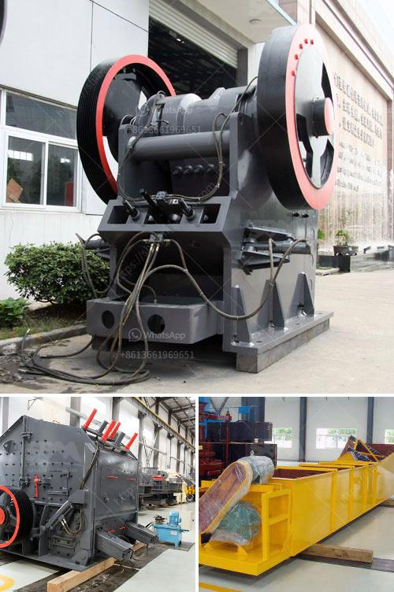

<h3>how to grind silica sand</h3>
Silica sand is a versatile industrial material that is used in many manufacturing processes. It can be used in everything from glassmaking to construction materials to even electronics. However, before it can be used in these applications, it needs to be ground into a fine powder. This article will explore the process of grinding silica sand to achieve the desired results.

To grind silica sand, the first step is to get the right equipment. There are several types of equipment that can be used, depending on the desired outcome. The most common equipment used for grinding silica sand is a ball mill, rotary mill, or vertical roller mill.

A ball mill is a cylindrical device used to grind or mix materials like ores, chemicals, ceramic raw materials, and paints. The ball mills rotate around a horizontal axis, partially filled with the material to be ground plus the grinding medium. Different materials are used as media, including ceramic balls, flint pebbles, and stainless steel balls. The speed of the balls and the material being ground can be controlled to achieve the desired fineness.

A rotary mill is a tumbling mill that uses a rotating drum filled with grinding media to grind the material being fed into it. The drum rotates around its axis, causing the grinding media to tumble and impact the material, resulting in the desired grinding action.

A vertical roller mill is another option for grinding silica sand. It consists of a rotating table and a set of grinding rollers arranged around the table. The material is fed into the center of the table, and the grinding rollers grind it by rolling over it, applying pressure, and shearing it against the table.

Before grinding, you need to prepare the silica sand. If the sand is wet, it needs to be dried before grinding. This can be done by spreading the silica sand onto a large flat surface and allowing it to air dry. Alternatively, you can use a drying machine to speed up the process.

Once the silica sand is prepared, it can be fed into the grinding equipment. The grinding process may take some time, depending on the desired fineness. It's important to monitor the grinding process regularly to ensure the desired results are achieved.

Once the grinding process is complete, the ground silica sand needs to be collected. This can be done using a sieve or a screening machine to separate the fine powder from the coarse particles. The fine powder can then be stored or used immediately, depending on its intended application.

In conclusion, grinding silica sand to achieve the desired fineness requires the right equipment and preparation. With the proper equipment, such as a ball mill, rotary mill, or vertical roller mill, and proper preparation of the silica sand, a fine powder can be obtained. Grinding silica sand is a crucial step in many industrial processes, ensuring the material is appropriately sized and ready for use in various applications.
<h3>Contact us</h3><ul><li><strong>Whatsapp:&nbsp;<a href="https://wa.me/8613661969651">+8613661969651</a></strong></li><li><a href="https://swt.shibang-china.com/?git&amp;zhl&amp;how to grind silica sand"><strong>Online Service(chat now)</strong></a></li></ul><h3>Related</h3><ul><li><a href='copper ore concentrate processing plant.md'>copper ore concentrate processing plant</a></li><li><a href='buy crusher plant.md'>buy crusher plant</a></li><li><a href='crusher cost equipment crusher malaysia.md'>crusher cost equipment crusher malaysia</a></li><li><a href='sand screener and washer.md'>sand screener and washer</a></li><li><a href='mica pearl process flowchart.md'>mica pearl process flowchart</a></li></ul>