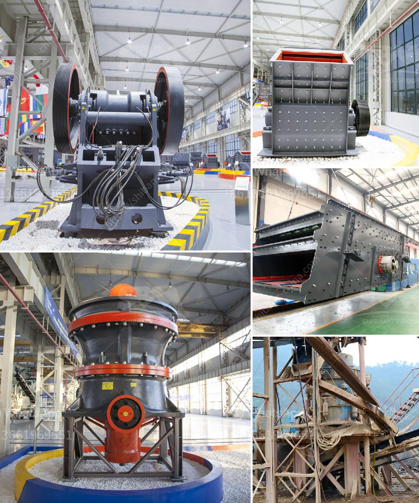

<h3>how to machine limestone</h3>
Limestone is a versatile and widely used natural stone that can be found in various buildings and architectural structures worldwide. It is a sedimentary rock known for its durability and aesthetic appeal. To fully utilize its potential, limestone often needs to be machined or shaped according to specific requirements. In this article, we will explore the process of machining limestone and the tools and techniques involved.

The first step in machining limestone is to determine the desired shape and form of the final product. This can range from simple cuts and shaping to more intricate carving and engraving. Once the design is decided, the appropriate tools and techniques can be employed.

One of the most commonly used tools for machining limestone is a diamond-tipped saw. This saw uses diamond particles embedded in the blade to cut through the tough surface of the stone. It ensures precise cuts and reduces the risk of chipping or rough edges. The saw can be used to create straight cuts or intricate shapes, depending on the desired outcome.

For more detailed or intricate designs, a handheld rotary tool with various attachments can be used. These attachments, such as grinding stones or diamond burrs, allow for more precise shaping and carving of the limestone. They can be used to remove excess material, refine edges, or create intricate patterns and textures.

Limestone can also be machined using water jet cutting technology. This method involves using a high-pressure jet of water mixed with abrasive particles to cut through the stone. Water jet cutting offers several advantages, including the ability to create complex shapes and patterns, minimal heat generation, and reduced risk of damage to the stone.

Regardless of the machining technique used, it is crucial to take appropriate safety precautions. For instance, wearing protective goggles, gloves, and a dust mask is essential to protect against dust particles generated during the machining process. Adequate ventilation in the workspace is also necessary to ensure good air quality and prevent the accumulation of dust.

Furthermore, it is important to check the hardness and composition of the limestone before machining. Harder limestone varieties may require different tools or techniques compared to softer varieties. Conducting a sample test on a small piece of limestone can help determine the most suitable machining approach for a specific project.

In conclusion, machining limestone requires specific tools, techniques, and safety measures to ensure a successful outcome. Diamond-tipped saws, handheld rotary tools, and water jet cutting are some of the commonly used methods. It is essential to understand the properties of the limestone and make appropriate adjustments in the machining process accordingly. Overall, with proper care and precision, machining limestone can result in beautiful, customized, and durable products for various applications.
<h3>Contact us</h3><ul><li><strong>Whatsapp:&nbsp;<a href="https://wa.me/8613661969651">+8613661969651</a></strong></li><li><a href="https://swt.shibang-china.com/?git&amp;zhl&amp;how to machine limestone"><strong>Online Service(chat now)</strong></a></li></ul><h3>Related</h3><ul><li><a href='crushers equipment dealer in saudi arabia.md'>crushers equipment dealer in saudi arabia</a></li><li><a href='concrete crusher for sale ethiopia.md'>concrete crusher for sale ethiopia</a></li><li><a href='cost of grinder machine mining crusher.md'>cost of grinder machine mining crusher</a></li><li><a href='stone crusher hammer mill.md'>stone crusher hammer mill</a></li><li><a href='how to calculate cost per ton crusher aggregate.md'>how to calculate cost per ton crusher aggregate</a></li></ul>