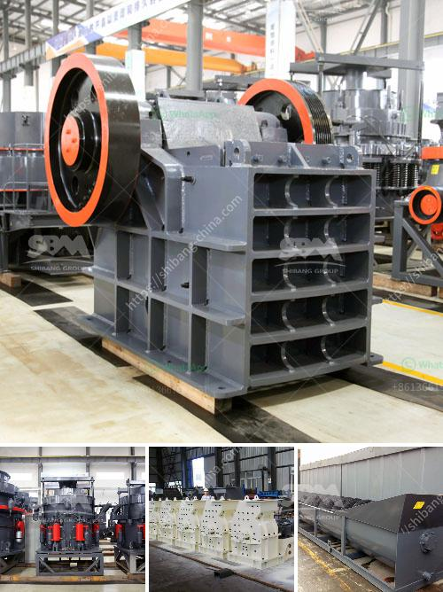

<h3>how to maintain stone crusher daily accounts in tally</h3>
Stone crushers are key equipment for rock crushing. With simple structure, easy operation, reliable performance, and convenient maintenance, stone crushers are widely used in limestone, granite, basalt, gravel, and other minerals processing plants. To effectively operate and maintain these crushers, a proper accounting system is crucial. This article discusses how to maintain stone crusher daily accounts in Tally.

Handling your financial accounts is a crucial part of managing your stone crushing business. So, naturally, maintaining accurate and detailed accounts is essential. Previously, record-keeping was done manually, which was both time-consuming and prone to human errors. However, with the advent of modern technology, efficient accounting software like Tally has simplified this process.

Tally is an accounting software widely used by businesses around the world. It offers various features that help you maintain your stone crusher's daily accounts with ease. The following steps outline how to efficiently maintain stone crusher daily accounts using Tally:

1. Set up Tally: First, make sure you have the latest version of Tally software installed on your computer. If not, download and install it from the official website. Once installed, create a new company in Tally and customize it according to your business requirements.

2. Create Expense Ledger: Go to the "Accounts Info" section in Tally and create a new ledger named "Expenses". Under this ledger, create sub-ledgers based on specific expenses like fuel, electricity, repairs, etc. This will help you categorize your expenses for better analysis and future reference.

3. Create Sales Ledger: Similarly, create a sales ledger to record your daily sales transactions. Under this ledger, create sub-ledgers for different types of sales like crushed stones, sand, boulders, etc.

4. Record Daily Expenses: As you carry out your stone crushing activities, make sure to record all the expenses incurred during the process. These expenses include fuel, wages, repairs, maintenance, etc. Enter these expenses in the respective ledger accounts in Tally. Make sure to include the date, nature of expense, and amount for each entry.

5. Record Sales Transactions: Once you start selling stones or other products, record the sales transactions in Tally. Enter the date of the sale, customer details, product type, quantity, and price. This will help you track your revenue and assess the profitability of your stone crushing business.

6. Reconcile Accounts: Regularly reconcile your accounts to ensure accuracy in your financial records. Match the expenses recorded in Tally with the invoices and receipts you have on hand. This will help identify any discrepancies and ensure that your accounts are up to date.

7. Generate Reports: Tally provides various reporting features to analyze your financial data. Utilize these features to generate profit and loss statements, balance sheets, and other relevant reports. These reports will give you a clear picture of your business's financial health, helping you make informed decisions.

8. Backup Data: It is crucial to regularly backup your accounting data to avoid any loss of information. Tally allows you to schedule automatic backups, ensuring secure storage of your financial records.

By following these steps and utilizing the features offered by Tally, you can efficiently maintain your stone crusher daily accounts. Accurate record-keeping will not only help you comply with tax regulations but also provide valuable insights into your business's financial performance. With a well-maintained accounting system, you can streamline your operations, control expenses, and propel the growth of your stone crushing business.
<h3>Contact us</h3><ul><li><strong>Whatsapp:&nbsp;<a href="https://wa.me/8613661969651">+8613661969651</a></strong></li><li><a href="https://swt.shibang-china.com/?git&amp;zhl&amp;how to maintain stone crusher daily accounts in tally"><strong>Online Service(chat now)</strong></a></li></ul><h3>Related</h3><ul><li><a href='quartz stone machine price.md'>quartz stone machine price</a></li><li><a href='mineral industrial crushers.md'>mineral industrial crushers</a></li><li><a href='ball mill suppliers in hyderabad.md'>ball mill suppliers in hyderabad</a></li><li><a href='gypsum processing line.md'>gypsum processing line</a></li><li><a href='crusher stone machine price.md'>crusher stone machine price</a></li></ul>