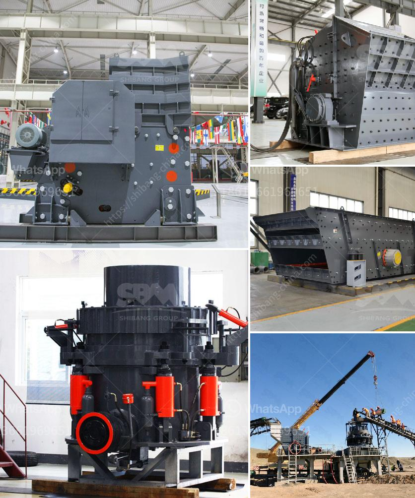

<h3>how to make silica rock pebles in ball mill</h3>
Silica rock pebbles are an essential material in various industries, including ceramics, electronics, and construction. These pebbles are commonly used as grinding media in ball mills, a popular method for grinding materials into fine powders. Creating silica rock pebbles in a ball mill requires patience and attention to detail. In this article, we will outline the necessary steps to successfully produce silica rock pebbles.

First and foremost, it is crucial to obtain high-quality silica rocks. Silica rocks are natural rocks formed primarily from silica, commonly found in the earth's crust. The rocks must be carefully selected with low impurity levels to ensure the final pebbles are of the highest quality. It is recommended to source silica rocks from reputable suppliers who can provide detailed information on the rock's characteristics.

After acquiring the silica rocks, the next step is to properly clean and wash them. Begin by removing any visible dirt or debris from the rocks. Subsequently, use water and a small brush to gently scrub the rocks to eliminate any remaining impurities. This cleaning process ensures that impurities will not contaminate the final pebbles.

Once the rocks are adequately cleaned, they must be dried. Use a clean cloth or paper towels to absorb any excess moisture from the rocks. It is important to ensure the rocks are completely dry before using them in the ball mill. Moisture can cause clumping or inconsistent grinding, negatively impacting the final product.

When the silica rocks are dry, it is time to load them into the ball mill. The ball mill is a cylindrical drum with various chamber compartments that grind materials by constantly rotating the drum on a horizontal axis. Ensure that the ball mill is clean and free from any debris before starting.

Add the silica rocks into the ball mill along with the grinding media. The grinding media can be made of various materials, such as ceramic, steel, or even natural pebbles. The choice of grinding media depends on the desired final product and the specific requirements of the milling process. Ensure the ratio between the silica rocks and the grinding media is appropriate, typically around a 1:1 to 1:2 ratio.

Once everything is loaded into the ball mill, secure the lid tightly to prevent any leakage. Start the mill and allow it to run for the desired duration, usually several hours or overnight, depending on the desired fineness of the silica rock pebbles. As the mill rotates, the silica rocks and grinding media will collide and crush each other, gradually reducing the size of the rocks into pebbles.

After the milling process is complete, stop the ball mill and carefully open the lid. The pebbles should be smaller and more rounded compared to the initial silica rocks. Carefully remove the pebbles from the ball mill and set them aside.

To ensure the silica rock pebbles meet the required specifications, they must undergo further testing. Confirm that the pebbles have the desired size distribution, hardness, and chemical composition. It is essential to eliminate any contaminants that might have been introduced during the milling process.

In conclusion, producing silica rock pebbles in a ball mill requires careful steps to achieve the desired final product. From selecting high-quality silica rocks to properly cleaning and drying them, every step plays a crucial role. By following these guidelines and paying attention to detail, one can successfully make silica rock pebbles in a ball mill for various applications.
<h3>Contact us</h3><ul><li><strong>Whatsapp:&nbsp;<a href="https://wa.me/8613661969651">+8613661969651</a></strong></li><li><a href="https://swt.shibang-china.com/?git&amp;zhl&amp;how to make silica rock pebles in ball mill"><strong>Online Service(chat now)</strong></a></li></ul><h3>Related</h3><ul><li><a href='industrial limestone crusher.md'>industrial limestone crusher</a></li><li><a href='calcium carbonate mining manufacturer in malaysia.md'>calcium carbonate mining manufacturer in malaysia</a></li><li><a href='coal crusher machine pdf.md'>coal crusher machine pdf</a></li><li><a href='ball mill in india.md'>ball mill in india</a></li><li><a href='raymond mill china.md'>raymond mill china</a></li></ul>