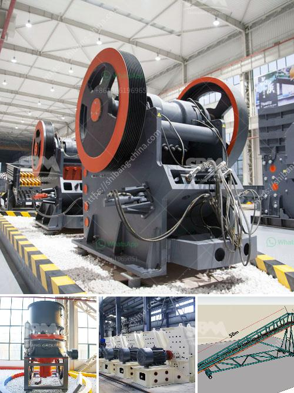

<h3>how to start a stone crusher business</h3>
Starting a stone crusher business requires a great deal of motivation and determination, as it involves a huge investment of time and money. No doubt, you want to ensure that your venture is successful and profitable. If you are considering entering the stone crusher business, here are some tips to get you started:

1. Identify your target market: To begin with, you need to identify who your potential customers will be. Are you targeting homeowners, construction companies, or both? By understanding your target market, you can tailor your business strategy and marketing efforts to attract the right customers.

2. Conduct thorough market research: Before investing in a stone crusher business, conduct thorough market research to determine the demand in your area. This will help you understand the competition, pricing, and potential profitability of the venture. It's important to assess the market dynamics and trends to make informed decisions.

3. Secure a suitable location: Finding an appropriate location for your stone crusher business is crucial. It should ideally be located near construction sites or areas with a high demand for building materials. Accessibility and proximity to transportation routes are also essential factors to consider.

4. Obtain necessary licenses and permits: Starting any business requires obtaining the necessary licenses and permits. Ensure that you comply with all local, state, and federal regulations. This may include obtaining permits for environmental compliance, zoning, and operating a quarry, among others.

5. Invest in necessary equipment and machinery: To operate a stone crusher business successfully, you will need some essential equipment and machinery. This includes crushers, conveyors, loaders, and site vehicles. Purchase or lease the required equipment considering your budget and the size of your operations.

6. Develop a strong marketing strategy: In order to attract customers, you need a solid marketing plan in place. Utilize both online and offline marketing channels, such as social media, websites, advertisements, and networking. Build relationships with contractors, architects, and construction companies in your area to gain referrals and repeat business.

7. Focus on customer satisfaction and quality: Building a strong reputation in the stone crushing industry requires providing high-quality products and services. Ensure that your products meet the required standards and that you deliver on time. Provide excellent customer service to keep your clients satisfied and happy to recommend your business to others.

In conclusion, starting a stone crusher business requires careful planning and execution. It's necessary to lay a strong foundation before you can enjoy the fruits of your labor. By following the tips mentioned above, you can position yourself for success in this competitive industry.
<h3>Contact us</h3><ul><li><strong>Whatsapp:&nbsp;<a href="https://wa.me/8613661969651">+8613661969651</a></strong></li><li><a href="https://swt.shibang-china.com/?git&amp;zhl&amp;how to start a stone crusher business"><strong>Online Service(chat now)</strong></a></li></ul><h3>Related</h3><ul><li><a href='mobile crusher plant for sale.md'>mobile crusher plant for sale</a></li><li><a href='equipment used in open pit copper ore mining plant.md'>equipment used in open pit copper ore mining plant</a></li><li><a href='how to draw a stone crusher.md'>how to draw a stone crusher</a></li><li><a href='coal crusher and screening plants for sale.md'>coal crusher and screening plants for sale</a></li><li><a href='apolo grinding mill price in india.md'>apolo grinding mill price in india</a></li></ul>