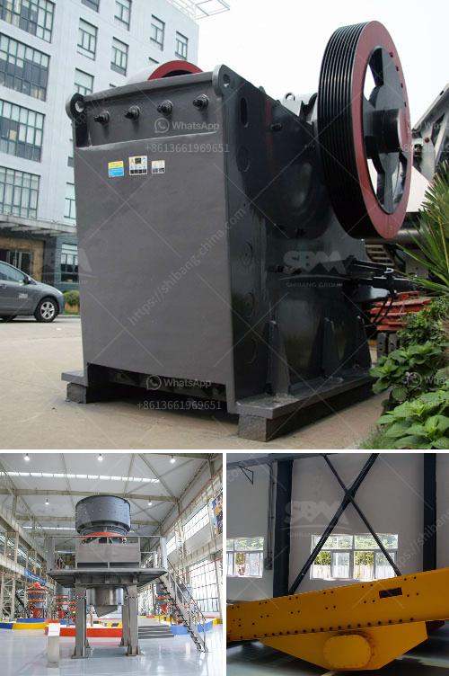

<h3>how to start a stone crushing business nigeria</h3>
Starting a stone crushing business is not an easy task. It requires substantial capital and knowledge in the areas of construction, engineering, quarrying, and recycling. To get started with a stone crushing business, it is important to understand the various requirements and implications.

Preparing a comprehensive business plan ensures that all aspects of the project are considered and gives the entrepreneur a clear roadmap to follow. This includes identifying the target market, conducting a market analysis, estimating costs, and projecting future revenues. It is also essential to secure the necessary licenses and permits to operate legally.

Finding a suitable location is crucial for a stone crushing business. The site should be close to construction sites where large quantities of stones are required. It should also have easy access to transportation routes and ample space for storing raw materials and finished products.

Acquiring the necessary equipment is another important step in setting up a stone crushing business. This includes crushers, screeners, conveyors, and other machinery necessary for crushing and screening various types of stones. It is advisable to purchase from reputable suppliers to ensure the quality and durability of the equipment.

Safety should be a top priority in a stone crushing business. All employees should be trained on the proper operation of equipment and health and safety regulations. Adequate safety measures, such as protective clothing and equipment guards, should be implemented to reduce the risk of accidents and injuries.

Finally, marketing and promotion are crucial to attract customers and generate revenue. Creating a strong online presence through a website and social media platforms can help reach a wider audience. Networking with construction companies, contractors, and other potential customers can also lead to valuable business opportunities.

In conclusion, starting a stone crushing business in Nigeria requires careful planning, licensing, acquisition of equipment, site selection, safety measures, and marketing efforts. It can be a profitable venture if done correctly, providing essential materials for the construction industry while creating employment opportunities.
<h3>Contact us</h3><ul><li><strong>Whatsapp:&nbsp;<a href="https://wa.me/8613661969651">+8613661969651</a></strong></li><li><a href="https://swt.shibang-china.com/?git&amp;zhl&amp;how to start a stone crushing business nigeria"><strong>Online Service(chat now)</strong></a></li></ul><h3>Related</h3><ul><li><a href='stone crusher company russia.md'>stone crusher company russia</a></li><li><a href='calcite processing equipment.md'>calcite processing equipment</a></li><li><a href='stone crusher for sale in south korea.md'>stone crusher for sale in south korea</a></li><li><a href='sandstone crusher quarry.md'>sandstone crusher quarry</a></li><li><a href='cement manufacturing plant.md'>cement manufacturing plant</a></li></ul>