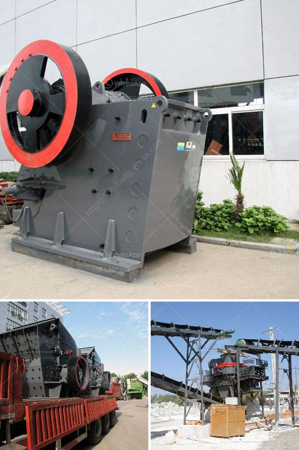

<h3>hpc cone crusher</h3>
When it comes to crushing equipment, it is hard to overlook the significance of cone crushers. Their simplicity and robustness have made them a staple for crushing applications across industries. However, with the increasing demands for efficiency and productivity, cone crushers must evolve to meet market demands. This is where the High-Performance Cone Crusher (HPC) stands out.

The HPC cone crusher is available in three different models: the HPC-200, HPC-300, and HPC-400. Each model has unique features that make it suitable for specific crushing applications. The HPC-200 model offers fine and medium crushing capability, while the HPC-300 model is capable of coarse and medium crushing, and the HPC-400 model offers extra coarse and fine crushing.

One of the key features that sets the HPC cone crusher apart is its advanced hydraulic system. This system ensures easy and efficient adjustment of the crusher settings, as well as an overload protection mechanism that allows for automatic tramp release. With the touch of a button, operators can adjust the crusher to achieve the desired product size and avoid damage caused by oversized or tramp materials.

Another standout feature of the HPC cone crusher is its high crushing capacity. Thanks to the combination of a larger crushing stroke, higher speed, and improved crushing chamber design, the HPC cone crusher delivers superior crushing efficiency. This means more tonnage with less energy consumption, resulting in substantial cost savings for operators.

In addition to its crushing capacity, the HPC cone crusher is also known for its versatility. It can be used in various crushing applications, including mining, aggregate, and recycling. The HPC cone crusher can provide a high reduction ratio and produce excellent particle shape without requiring excessive amounts of power.

Furthermore, the HPC cone crusher is also environmentally friendly. With the advanced hydraulic system and efficient dust suppression, it minimizes dust emissions and noise levels during operation. This makes it an ideal choice for operations located near residential areas or sensitive environmental regions.

Maintenance and servicing of the HPC cone crusher are made easy with its user-friendly design. The hydraulic system allows for quick and trouble-free maintenance, while the access to critical components and the tilting of the main frame make inspection and replacement tasks more efficient.

In conclusion, the HPC cone crusher is an ideal choice for industries such as mining, aggregate, and recycling, as well as a variety of other applications. It offers high crushing capacity, excellent particle shape, and efficient operation, along with advanced hydraulic system and easy maintenance. By investing in the HPC cone crusher, operators can improve their overall crushing efficiency, reduce operating costs, and contribute to a more sustainable future.
<h3>Contact us</h3><ul><li><strong>Whatsapp:&nbsp;<a href="https://wa.me/8613661969651">+8613661969651</a></strong></li><li><a href="https://swt.shibang-china.com/?git&amp;zhl&amp;hpc cone crusher"><strong>Online Service(chat now)</strong></a></li></ul><h3>Related</h3><ul><li><a href='slag crushing machine.md'>slag crushing machine</a></li><li><a href='silica sand manufacturing plant.md'>silica sand manufacturing plant</a></li><li><a href='tph jaw crusher price.md'>tph jaw crusher price</a></li><li><a href='buy stone crusher machine in saudi arabia.md'>buy stone crusher machine in saudi arabia</a></li><li><a href='mini rock crushers.md'>mini rock crushers</a></li></ul>