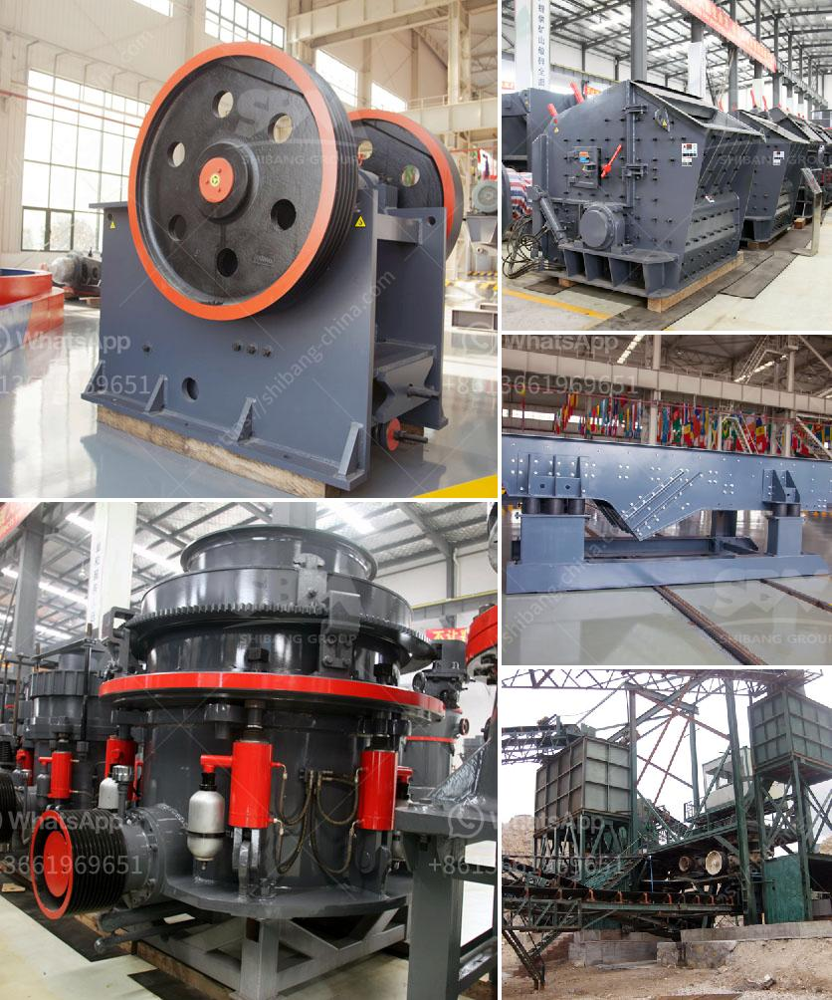

<h3>hydrated lime production processing</h3>
Hydrated lime, also known as calcium hydroxide, is a versatile industrial chemical that has numerous applications in various industries. It is produced through a complex process that involves several stages of processing to ensure high-quality and pure hydrated lime. This article will provide an overview of the hydrated lime production process.

The production process of hydrated lime begins with the extraction of limestone from quarries or mines. Limestone is a sedimentary rock composed primarily of calcium carbonate, which is then broken down into smaller pieces using a crusher. The crushed limestone is then fed into a kiln where it is heated at high temperatures for several hours to produce quicklime or calcium oxide.

The next step in the production process is the hydration of quicklime. Quicklime is mixed with water in a process called slaking, which results in the formation of calcium hydroxide or hydrated lime. The slaking process can be achieved through different methods, including batch slaking or continuous slaking. Batch slaking involves adding a predetermined amount of water to the quicklime in a batch mixer, while continuous slaking involves continuously adding water to a fluidized bed of quicklime.

After the slaking process, the hydrated lime slurry is subjected to centrifugation or filtration to separate the solids from the liquid. This step is crucial to remove impurities and ensure the purity of the hydrated lime. The resulting liquid is then dried, usually by using a rotary or flash dryer, to remove excess moisture and obtain a fine powder.

The dried hydrated lime powder can be further processed to produce different grades of hydrated lime, depending on the desired specifications and applications. This can involve grinding the powder to achieve a specific particle size or adding additives to modify the properties of the hydrated lime.

Hydrated lime is widely used in various industries due to its excellent properties. In the construction industry, it is commonly used as a mortar additive to improve workability and strength. It also acts as a soil stabilizer in agriculture and is used in wastewater treatment to control pH levels. Hydrated lime is also utilized in the manufacturing of steel, paper, and chemicals.

In conclusion, the production of hydrated lime involves a series of processing stages to extract and convert limestone into high-quality calcium hydroxide. From quarrying limestone to slaking quicklime and drying the resulting powder, the process ensures the production of pure, versatile hydrated lime. With its wide range of applications, hydrated lime is an essential chemical in various industries, contributing to the development and growth of these sectors.
<h3>Contact us</h3><ul><li><strong>Whatsapp:&nbsp;<a href="https://wa.me/8613661969651">+8613661969651</a></strong></li><li><a href="https://swt.shibang-china.com/?git&amp;zhl&amp;hydrated lime production processing"><strong>Online Service(chat now)</strong></a></li></ul><h3>Related</h3><ul><li><a href='grinding mill of cerial in ethiopia.md'>grinding mill of cerial in ethiopia</a></li><li><a href='crusher agreegade suppliers durban.md'>crusher agreegade suppliers durban</a></li><li><a href='stone crusher 80 tons of jam.md'>stone crusher 80 tons of jam</a></li><li><a href='3 roller mill and new zealand.md'>3 roller mill and new zealand</a></li><li><a href='companies selling mining equipment.md'>companies selling mining equipment</a></li></ul>