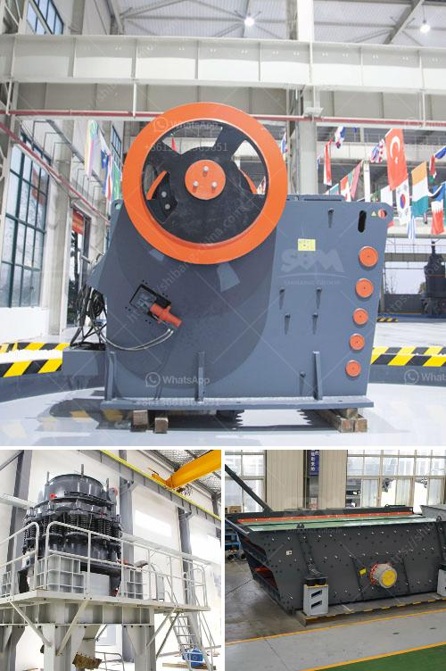

<h3>hydraulic jaw crusher 30 x 40</h3>
The hydraulic jaw crusher 30 x 40 is one of the most popular and widely used crushing devices in the mining and construction industry. The jaw crusher features a deep crushing chamber, full hydraulic adjustment of closed side setting, toggle plate adjustment, and large feed opening. With these advanced features, the hydraulic jaw crusher 30 x 40 offers a great combination of productivity, ease of maintenance, and reliability.

One of the main advantages of the hydraulic jaw crusher 30 x 40 is its ability to adjust the closed side setting, which allows the crusher to be adjusted according to the different needs of the application. This feature is particularly useful when dealing with different types of materials or when a specific particle size is required. The hydraulic adjustment system ensures quick and easy setting changes, without the need for additional tools or complicated procedures.

Another important feature of the hydraulic jaw crusher 30 x 40 is its large feed opening. The generously sized feed opening allows the crusher to handle large and irregularly shaped materials. This is a significant advantage, as it reduces the risk of clogging and ensures a continuous flow of material through the crusher. In addition, the large feed opening also contributes to a higher crushing capacity, making the hydraulic jaw crusher suitable for handling heavy-duty applications.

The hydraulic jaw crusher 30 x 40 is also equipped with a toggle plate mechanism, which provides a continuous and uniform crushing force on the material being crushed. This helps to ensure a consistent product size and reduces the risk of uneven wear or damage to the crusher components. The toggle plate mechanism can be easily adjusted, allowing for different sizes of material to be crushed.

Furthermore, the hydraulic jaw crusher 30 x 40 is designed with an advanced overload protection system. This system helps to prevent damage to the crusher in the event of an excessive load or an unexpected blockage of the crushing chamber. The overload protection system automatically releases the hydraulic pressure and allows the crusher to continue operation once the overload condition is removed or the blockage is cleared.

In terms of maintenance, the hydraulic jaw crusher 30 x 40 is designed with convenience and ease in mind. The crusher is equipped with a hydraulic system that allows for easy access to key components for inspection, maintenance, and repair. This helps to minimize downtime and increase operational efficiency.

Overall, the hydraulic jaw crusher 30 x 40 is a reliable and efficient crushing device that offers a wide range of benefits for various applications. Its advanced features, including the hydraulic adjustment system, large feed opening, toggle plate mechanism, and overload protection system, make it a versatile choice for crushing operations. With its high productivity and easy maintenance, the hydraulic jaw crusher 30 x 40 is a valuable addition to any crushing plant.
<h3>Contact us</h3><ul><li><strong>Whatsapp:&nbsp;<a href="https://wa.me/8613661969651">+8613661969651</a></strong></li><li><a href="https://swt.shibang-china.com/?git&amp;zhl&amp;hydraulic jaw crusher 30 x 40"><strong>Online Service(chat now)</strong></a></li></ul><h3>Related</h3><ul><li><a href='distributor cone crusher indonesia.md'>distributor cone crusher indonesia</a></li><li><a href='equipment needed for quarry crusher.md'>equipment needed for quarry crusher</a></li><li><a href='used cone crusher for sale ton per hour.md'>used cone crusher for sale ton per hour</a></li><li><a href='turkey ball mill company.md'>turkey ball mill company</a></li><li><a href='calcite milling equipment for sale.md'>calcite milling equipment for sale</a></li></ul>