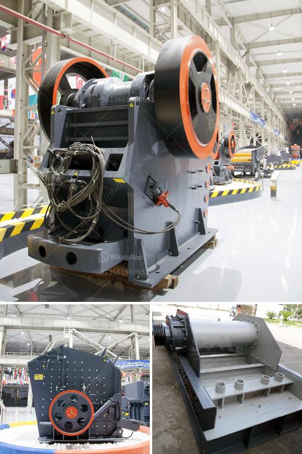

<h3>i want a powder grinding mill for sale</h3>
Whether you are a small-scale business owner or part of a large industrial setup, having a powder grinding mill at your disposal can greatly enhance your operations. This advanced machinery is designed to grind different types of materials into fine powders, making it an essential tool across various industries. If you find yourself in need of a powder grinding mill that fits your requirements, there are several key factors to consider when looking for a reliable machine for sale.

1. Efficiency: A powder grinding mill is known for its exceptional efficiency in reducing solid materials into smaller particles. It can process a wide range of materials including minerals, chemicals, pharmaceuticals, food products, and more.

2. Versatility: With different configurations available, powder grinding mills can adapt to various grinding processes such as crushing, grinding, pulverizing, and homogenizing. This versatility ensures that the machine can handle different demands with ease.

3. High-Quality Output: When it comes to producing fine powders, a powder grinding mill is unparalleled in its ability to ensure a consistent and uniform particle size. This ensures the quality of the finished products, regardless of the material being processed.

When searching for a powder grinding mill for sale, it is crucial to consider certain factors to make an informed decision:

1. Capacity: Determine the output capacity required for your industrial needs. Consider the volume and frequency of materials to be processed to ensure the selected mill can handle the workload effectively.

2. Quality and Durability: Look for mills made by reputable manufacturers known for their high-quality standards and durable construction. A reliable and durable mill will offer longevity, low maintenance costs, and uninterrupted operations.

3. Customization Options: Depending on your specific requirements, mills with various grinding methods, attachments, and capabilities may be necessary. Looking for flexibility in customization will allow you to adapt the machine to your unique needs.

In conclusion, a powder grinding mill is an invaluable asset for any business that deals with materials requiring comminution. Its ability to grind materials into fine powders with high precision and efficiency can greatly enhance industrial processes. Careful consideration of your capacity needs, quality standards, and customization options will help you find the ideal mill that meets your requirements. So, if you're in search of a powder grinding mill for sale, remember to invest in a reliable and versatile machine to elevate your industrial operations to new heights.
<h3>Contact us</h3><ul><li><strong>Whatsapp:&nbsp;<a href="https://wa.me/8613661969651">+8613661969651</a></strong></li><li><a href="https://swt.shibang-china.com/?git&amp;zhl&amp;i want a powder grinding mill for sale"><strong>Online Service(chat now)</strong></a></li></ul><h3>Related</h3><ul><li><a href='coal machinery for coal processing crusher.md'>coal machinery for coal processing crusher</a></li><li><a href='coal powder making machine.md'>coal powder making machine</a></li><li><a href='machine price list ball mill for silica sand.md'>machine price list ball mill for silica sand</a></li><li><a href='jaw crusher comparison advantages.md'>jaw crusher comparison advantages</a></li><li><a href='bentonite manufacturing process image.md'>bentonite manufacturing process image</a></li></ul>