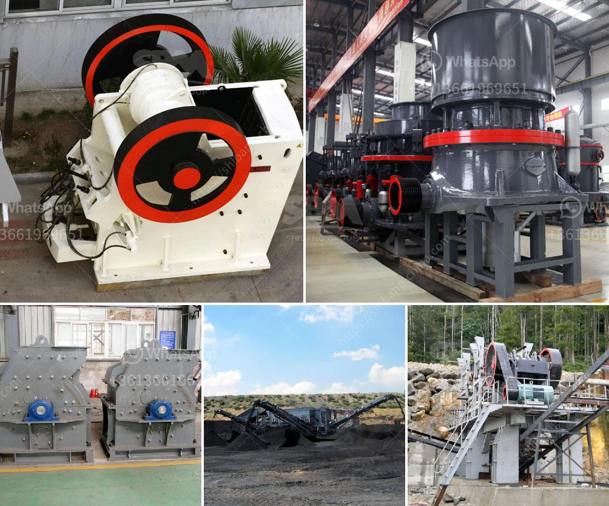

<h3>impact crusher 70 130tph</h3>
The Impact Crusher 70-130tph is a versatile and powerful machine that offers exceptional performance in both primary and secondary crushing applications. The robust design along with high-quality components and optimized wear parts make this crushing equipment ideal for crushing various types of materials.

One of the key features of the Impact Crusher 70-130tph is the interchangeable wear parts. These parts can be easily replaced when worn out, reducing downtime and increasing operational efficiency. With a wide range of optional configurations available, operators can customize the machine to suit their specific requirements.

The 70-130tph Impact Crusher also features a hydraulic opening mechanism, allowing for easy and quick access to the crushing chamber. This feature simplifies maintenance and ensures minimal disruption to operations. The hydraulic adjustment system further enhances the versatility of this crusher, enabling precise control over the finished product size.

Another notable feature of the Impact Crusher 70-130tph is its high production capacity. The machine can process up to 250 tons per hour, making it suitable for large-scale crushing projects. The efficient crushing chamber design optimizes the crushing process, resulting in a high reduction ratio and excellent particle shape.

Safety is of utmost importance in any crushing operation, and the Impact Crusher 70-130tph takes this aspect seriously. The machine is equipped with a comprehensive range of safety features, including a protection guard for the main conveyor, emergency stops, and an automatic central lubrication system. These features ensure safe and reliable operation at all times.

In conclusion, the Impact Crusher 70-130tph is a reliable and efficient crushing machine that offers outstanding performance in various crushing applications. With its interchangeable wear parts, hydraulic opening mechanism, and high production capacity, this crusher is a valuable addition to any crushing plant. It delivers consistent, high-quality results and ensures safe and hassle-free operation. Whether used in primary or secondary crushing, the Impact Crusher 70-130tph is a cost-effective solution for crushing a wide range of materials.
<h3>Contact us</h3><ul><li><strong>Whatsapp:&nbsp;<a href="https://wa.me/8613661969651">+8613661969651</a></strong></li><li><a href="https://swt.shibang-china.com/?git&amp;zhl&amp;impact crusher 70 130tph"><strong>Online Service(chat now)</strong></a></li></ul><h3>Related</h3><ul><li><a href='jaw crusher 50 mt hour for sale.md'>jaw crusher 50 mt hour for sale</a></li><li><a href='ball mill lining made in china.md'>ball mill lining made in china</a></li><li><a href='roller mill from china.md'>roller mill from china</a></li><li><a href='project report for quartz stone plant and quarry.md'>project report for quartz stone plant and quarry</a></li><li><a href='stones grinding plant thailand.md'>stones grinding plant thailand</a></li></ul>