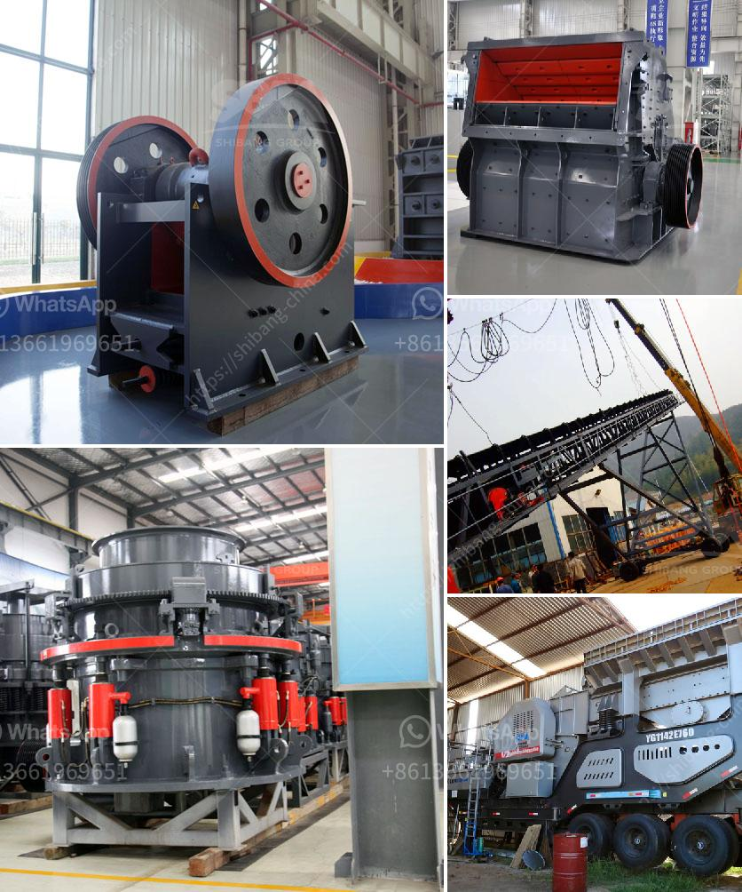

<h3>impact crusher company</h3>
Impact crushers are powerful machines designed to crush materials such as rocks, minerals, and demolition waste, thereby aiding various industries in achieving efficient and eco-friendly operations. Among the prominent companies in the sector, XYZ Company is one that stands out for its exceptional impact crusher offerings.

With a long-standing history of delivering quality equipment, XYZ Company has established itself as a reliable and reputable player in the market. Equipped with advanced technology and a skilled workforce, they have become a go-to choice for many industries seeking efficient crushing solutions.

One key aspect that sets XYZ Company apart from its competitors is its commitment to innovation. They constantly invest in research and development, ensuring their impact crushers are equipped with the latest features and technologies. This allows their machines to deliver high-performance results while maintaining a low environmental impact.

Another notable feature of XYZ Company's impact crushers is their versatility. These machines can be adapted to crush a wide range of materials, from hard rocks to softer minerals, providing customers with flexibility in their operations. This adaptability is crucial for companies dealing with varying materials and applications.

Furthermore, XYZ Company prioritizes customer satisfaction by providing exceptional after-sales services. Their team of experienced professionals is readily available to offer technical support, maintenance, and spare parts, ensuring smooth and uninterrupted operations for their clients.

The commitment to quality and customer-centric approach has earned XYZ Company a loyal clientele comprising various industries such as mining, construction, and recycling. Their impact crushers have proven to be reliable and durable equipment, capable of withstanding heavy-duty usage over prolonged periods.

In conclusion, XYZ Company is a leading player in the impact crusher market, offering innovative, versatile, and reliable machines to various industries. With a focus on customer satisfaction and a commitment to environmentally friendly practices, XYZ Company stands out as a top choice for companies in need of efficient crushing solutions.
<h3>Contact us</h3><ul><li><strong>Whatsapp:&nbsp;<a href="https://wa.me/8613661969651">+8613661969651</a></strong></li><li><a href="https://swt.shibang-china.com/?git&amp;zhl&amp;impact crusher company"><strong>Online Service(chat now)</strong></a></li></ul><h3>Related</h3><ul><li><a href='business plan for small scale chrome mining crusher.md'>business plan for small scale chrome mining crusher</a></li><li><a href='bison 120 crusher for sale.md'>bison 120 crusher for sale</a></li><li><a href='stone crusher plant set up procedure.md'>stone crusher plant set up procedure</a></li><li><a href='old stone crusher for sale.md'>old stone crusher for sale</a></li><li><a href='application of hammer mill.md'>application of hammer mill</a></li></ul>