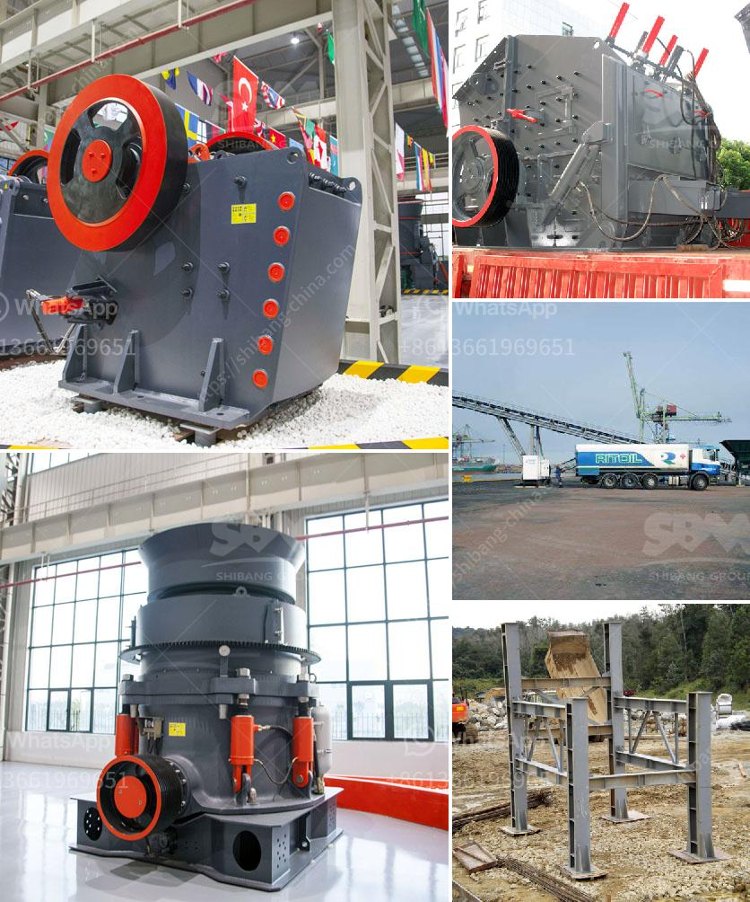

<h3>impact crusher discount</h3>
With the constant development and improvement of technology, industries are always on the lookout for cost-effective and efficient machinery to boost their operations. One such machinery that has proven to be indispensable for various industries is the impact crusher.

An impact crusher is a heavy-duty machine designed to crush materials into smaller particles. It utilizes a powerful blow bar to impact the material, which breaks it into smaller pieces. This machinery is commonly used in mining, construction, and recycling industries, among others, to reduce the size of raw materials for further processing.

Now, the good news for industries in need of impact crushers is that they are now available at a discounted price. With the impact crusher discount, industries can invest in a high-quality machine without worrying about the hefty price tag. This discount allows them to save money upfront while still acquiring a reliable and efficient impact crusher.

The impact crusher discount offers an excellent opportunity for industries looking to improve their productivity and profitability. By investing in an impact crusher at a lower cost, industries can enhance their material processing capabilities and increase their overall efficiency. With a more efficient process, businesses can meet demand more quickly and reduce downtime, resulting in higher output and improved profits.

Furthermore, the impact crusher discount allows industries to stay ahead of their competitors by acquiring the latest technology at a more affordable rate. With advancements in impact crusher design and capabilities, industries can benefit from improved performance and better particle size control, leading to higher quality end products.

In conclusion, the impact crusher discount presents a fantastic opportunity for industries to upgrade their machinery at a lower cost. By investing in an impact crusher, businesses can enhance their material processing capabilities, increase efficiency, and stay competitive in their respective fields. Don't miss out on this chance to improve your operations while saving money.
<h3>Contact us</h3><ul><li><strong>Whatsapp:&nbsp;<a href="https://wa.me/8613661969651">+8613661969651</a></strong></li><li><a href="https://swt.shibang-china.com/?git&amp;zhl&amp;impact crusher discount"><strong>Online Service(chat now)</strong></a></li></ul><h3>Related</h3><ul><li><a href='7x8 foot ball mills.md'>7x8 foot ball mills</a></li><li><a href='jaw crusher plant price.md'>jaw crusher plant price</a></li><li><a href='equipment use in the mining of laterite.md'>equipment use in the mining of laterite</a></li><li><a href='equipment cost for silica sand mining.md'>equipment cost for silica sand mining</a></li><li><a href='grinding roller mill machine.md'>grinding roller mill machine</a></li></ul>