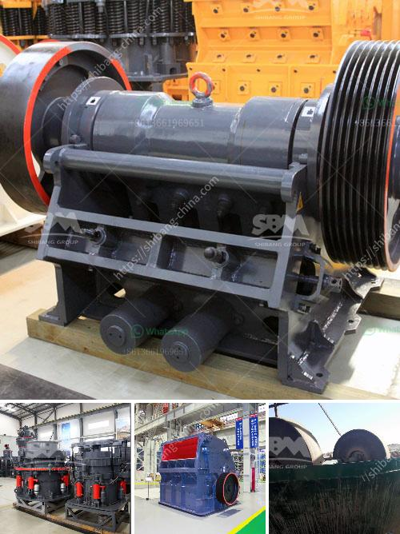

<h3>impact crusher in lima peru</h3>
Lima, the captivating capital city of Peru, is known for its rich history, stunning architecture, and vibrant culture. As the city continues to evolve and grow, so too does its infrastructure. This is where the importance of the impact crusher comes into play, as this powerful machine plays a crucial role in shaping the future of Lima.

The impact crusher is a versatile and efficient machine that is capable of breaking down materials with ease. Its robust design and high-quality construction ensure that it can withstand the harshest of conditions. From crushing limestone to recycling concrete, the impact crusher offers numerous applications that contribute to the development of Lima.

One key area in which the impact crusher excels is in the construction industry. As Lima undergoes various building projects, such as the construction of highways, bridges, and buildings, the demand for high-quality aggregates is on the rise. The impact crusher can easily handle large quantities of rocks, making it an indispensable tool in the production of construction materials.

Furthermore, the impact crusher also plays a vital role in the mining industry in Lima. Peru is a country rich in mineral resources, and mining plays a significant role in its economy. The impact crusher is widely utilized in mining operations to reduce the size of ores and facilitate the extraction process. By crushing the ores into smaller pieces, the impact crusher enables miners to extract valuable minerals more efficiently.

Another area where the impact crusher proves its worth is in environmental sustainability. By recycling construction and demolition waste, Lima can reduce its environmental footprint and contribute to a greener future. The impact crusher can effectively process and crush materials, such as concrete and asphalt, turning them into reusable aggregates. This not only reduces the demand for natural resources but also minimizes waste generation.

In conclusion, the impact crusher is a game-changer in Lima, Peru. Whether in construction, mining, or environmental sustainability, this powerful machine contributes to the development and growth of the city. As Lima continues to build and shape its future, the impact crusher will undoubtedly play a vital role in meeting the demands of a rapidly evolving urban environment.
<h3>Contact us</h3><ul><li><strong>Whatsapp:&nbsp;<a href="https://wa.me/8613661969651">+8613661969651</a></strong></li><li><a href="https://swt.shibang-china.com/?git&amp;zhl&amp;impact crusher in lima peru"><strong>Online Service(chat now)</strong></a></li></ul><h3>Related</h3><ul><li><a href='slag crushing plant.md'>slag crushing plant</a></li><li><a href='white stone crusher plant in rajasthan.md'>white stone crusher plant in rajasthan</a></li><li><a href='barite jaw crusher manufacturing companies.md'>barite jaw crusher manufacturing companies</a></li><li><a href='pf series impact crushers in alibaba.md'>pf series impact crushers in alibaba</a></li><li><a href='buy mobile crusher.md'>buy mobile crusher</a></li></ul>