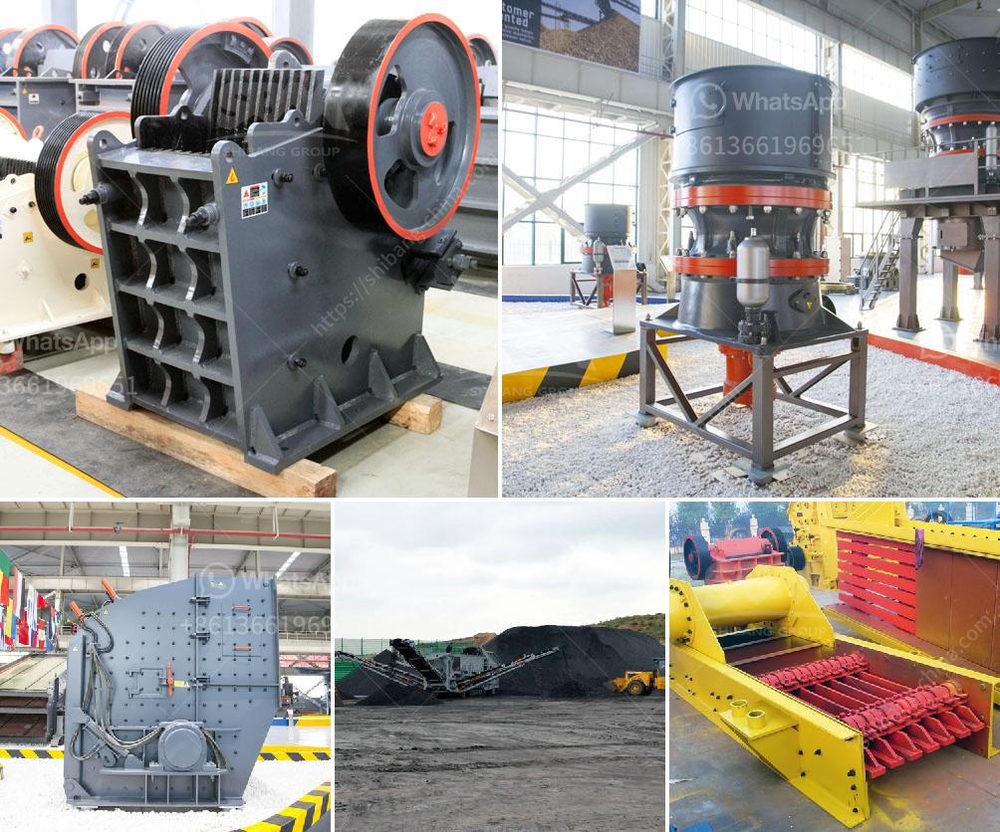

<h3>impact crusher korea</h3>
In the ever-evolving construction industry, the demand for more efficient and cost-effective equipment has become paramount. With the rise of new technologies and innovations, impact crushers have emerged as one of the most reliable and effective solutions for crushing and screening tasks. In particular, impact crusher Korea has made significant strides in the field, offering superior performance and versatility in a wide range of applications.

The impact crusher is a heavy-duty machine that crushes materials using impact energy. This energy is generated by the rotors rotating at high speeds, striking the material to be crushed with great force. When the material is fed into the crushing chamber, it is subjected to the high-speed impact of the blow bars, shattering it into smaller pieces. These smaller pieces then pass through the bottom of the machine, producing the desired product size.

One of the key advantages of impact crusher Korea is its ability to produce a uniform product size with high crushing ratios. This means that a single machine can effectively crush a wide range of materials, including soft and medium-hard rocks, limestone, and even recycled concrete. The adjustable impact racks allow for precise control of the product size, enabling the crusher to be customized for specific applications.

Moreover, impact crusher Korea is known for its high efficiency and low operating costs. The advanced design of the crushing chamber ensures optimal utilization of the available energy, resulting in reduced energy consumption per ton of crushed material. This translates into lower fuel consumption and lower operating costs, making impact crushers a cost-effective choice for construction companies.

Furthermore, one of the standout features of impact crusher Korea is its durability and reliability. The rugged construction, combined with high-quality components, ensures that the crusher can withstand even the harshest operating conditions. Whether it is crushing large rocks or processing abrasive materials, impact crushers are built to last and deliver consistent performance.

Another noteworthy aspect of impact crusher Korea is its ease of maintenance. The accessible design of the crusher allows for quick and convenient inspection and maintenance procedures. This minimizes downtime and ensures that the crusher operates at peak efficiency at all times, reducing the overall cost of ownership.

In conclusion, impact crusher Korea has revolutionized the construction industry by providing a reliable, efficient, and cost-effective solution for crushing and screening tasks. Its ability to produce a uniform product size, high crushing ratios, and low operating costs make it a versatile choice for a wide range of applications. Whether used in mining operations, road construction, or recycling projects, impact crushers deliver exceptional performance and play a crucial role in shaping the future of the construction industry.
<h3>Contact us</h3><ul><li><strong>Whatsapp:&nbsp;<a href="https://wa.me/8613661969651">+8613661969651</a></strong></li><li><a href="https://swt.shibang-china.com/?git&amp;zhl&amp;impact crusher korea"><strong>Online Service(chat now)</strong></a></li></ul><h3>Related</h3><ul><li><a href='used grinding mills for sale.md'>used grinding mills for sale</a></li><li><a href='mobile crusher plant for hire in mpumalanga province.md'>mobile crusher plant for hire in mpumalanga province</a></li><li><a href='ball mill lining made in china.md'>ball mill lining made in china</a></li><li><a href='stones grinding plant thailand.md'>stones grinding plant thailand</a></li><li><a href='production process of limestone.md'>production process of limestone</a></li></ul>