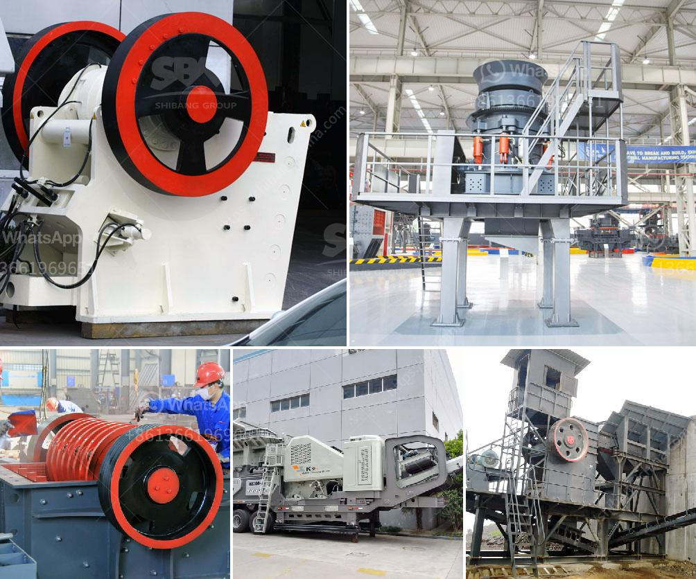

<h3>impact crusher plant for sale</h3>
An impact crusher is a versatile and efficient machine that breaks down and reduces rocks, concrete, or asphalt into smaller, more manageable sizes. In the construction and mining industry, it is often used for the crushing of limestone, coal, and other brittle materials.

When looking for an impact crusher plant for sale, you will find a wide range of options to choose from. Various manufacturers offer this equipment with different specifications and features. In this article, we will discuss the advantages and benefits of owning an impact crusher plant, as well as some key factors to consider when making a purchase.

One of the main advantages of an impact crusher plant is its ability to produce a high-quality cubical product. Unlike other crushers, such as jaw or cone crushers, an impact crusher uses the principle of impact to pulverize the materials. This results in a uniform shape and size of the final product, which is highly desirable in many applications.

Another benefit of this equipment is its cost-effectiveness. An impact crusher plant typically requires less capital investment compared to other crushing equipment. This makes it an attractive option for businesses with limited budgets or those looking to expand their operations without breaking the bank.

Additionally, an impact crusher plant offers excellent versatility. With adjustable settings and interchangeable blow bars, you can easily customize the machine to suit your specific needs. Whether you need to crush hard rock or recycle concrete, an impact crusher can handle a wide range of materials, making it a valuable asset for any construction or mining project.

When choosing an impact crusher plant for sale, there are several key factors to consider. First and foremost is the capacity of the machine. You should determine the maximum throughput required for your application. This will ensure that the plant can handle the volume of material you need to process efficiently.

Next, evaluate the power and efficiency of the crusher. Look for models with high horsepower and optimized crushing chambers that deliver maximum productivity with minimum energy consumption. This will not only maximize your production output but also reduce operating costs in the long run.

Durability is another crucial aspect to consider. Investing in a reliable and robust impact crusher plant will minimize maintenance and downtime, ultimately saving you money and increasing your profitability. Look for features such as heavy-duty construction, reinforced wear parts, and advanced automation systems for smooth operation and easy maintenance.

Lastly, consider the after-sales support provided by the manufacturer or supplier. A reputable company will offer comprehensive customer service, including spare parts availability and technical support. This ensures that your impact crusher plant will continue to operate at peak performance throughout its lifespan.

In conclusion, an impact crusher plant is a valuable asset for any construction or mining operation. Its ability to produce high-quality cubical products, cost-effectiveness, and versatile applications make it a popular choice among industry professionals. By understanding the key factors discussed above and conducting thorough research, you can confidently invest in an impact crusher plant that meets your specific requirements.
<h3>Contact us</h3><ul><li><strong>Whatsapp:&nbsp;<a href="https://wa.me/8613661969651">+8613661969651</a></strong></li><li><a href="https://swt.shibang-china.com/?git&amp;zhl&amp;impact crusher plant for sale"><strong>Online Service(chat now)</strong></a></li></ul><h3>Related</h3><ul><li><a href='cocount crushing manchine.md'>cocount crushing manchine</a></li><li><a href='pilot scale ball mills.md'>pilot scale ball mills</a></li><li><a href='concrete crusher for sale ethiopia.md'>concrete crusher for sale ethiopia</a></li><li><a href='ball mill sale in cali.md'>ball mill sale in cali</a></li><li><a href='grinding or crushing for gypsum pdf.md'>grinding or crushing for gypsum pdf</a></li></ul>