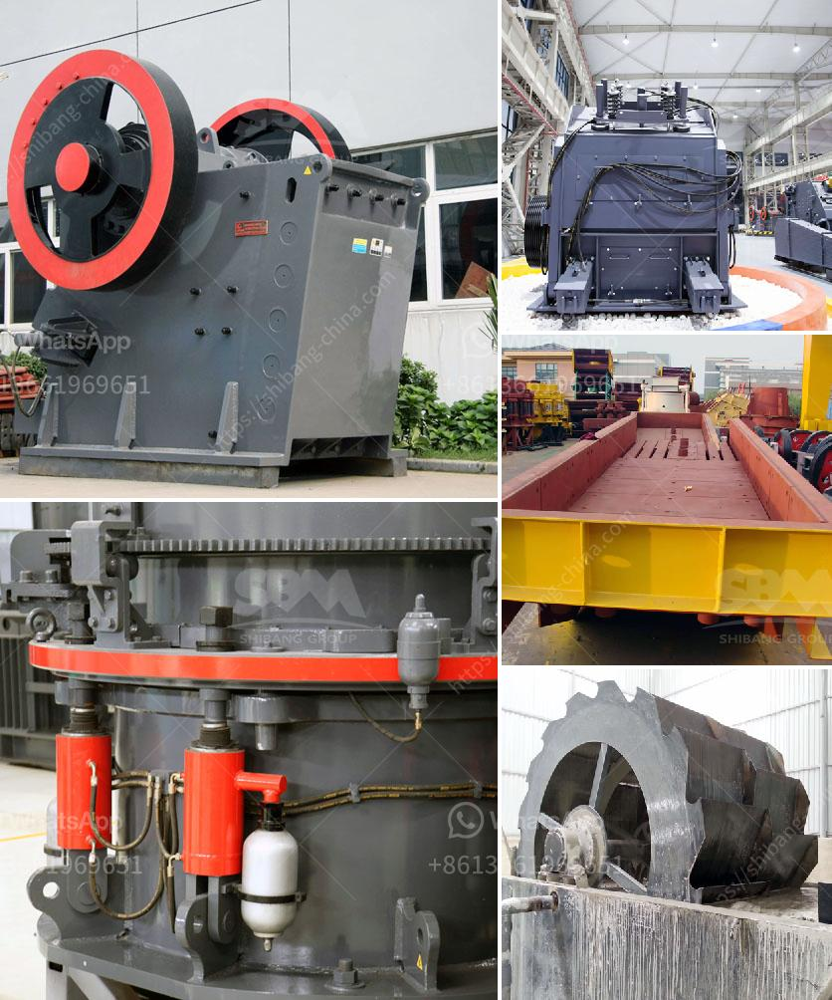

<h3>impact crusher tanzania</h3>
Tanzania is a country that has abundant reserves of limestone, gold, coal, iron, uranium, and many other minerals. The impact crusher is used to crush these materials and transform them into smaller particles. With the rapid urbanization and industrialization in Tanzania, the mining industry is witnessing significant growth. The impact crusher provides a perfect solution for the mining industry in Tanzania as it is designed to crush ores, stones, and rocks efficiently and economically.

Mining in Tanzania dates back to the pre-colonial era when Arab and local traders mined and traded various minerals in the region. The industry experienced a major boom in the early 2000s, with a considerable increase in foreign investment and production. Today, Tanzania is the fourth-largest gold producer in Africa and has significant reserves of other minerals such as nickel, diamond, gemstones, and coal.

Mining involves extracting various minerals from beneath the earth's surface, requiring extensive operations that can cause environmental damage. Traditional mining methods like drilling and blasting can cause significant fragmentation of the rocks, making it difficult to extract minerals efficiently. Moreover, the extracted materials need to be crushed into smaller sizes to facilitate their transportation and processing.

The impact crusher has become an essential tool in modern mining due to its ability to crush ores, stones, and rocks efficiently and economically. It utilizes a high-speed impact force to break the material, producing a uniform particle shape. This makes the crushed materials easier to handle, process, and transport.

1. Versatility: The impact crusher can handle a wide range of materials, including limestone, concrete, coal, and other minerals. It is capable of crushing both soft and hard rock materials with a maximum feed size of up to 800mm.

2. Reduced Downtime: The impact crusher is equipped with advanced hydraulic systems, allowing for quick and easy maintenance. This reduces downtime and increases productivity, ensuring optimal operation of the mining process.

3. Cost-Effectiveness: The impact crusher is a cost-effective solution for crushing materials in large quantities. It requires less energy compared to traditional crushing methods and has a high throughput capacity, allowing for efficient production.

4. Environmental-Friendly: The impact crusher produces minimal noise and dust emissions, making it environmentally friendly. It complies with international environmental standards, ensuring sustainable mining practices in Tanzania.

With the increasing demand for minerals in Tanzania, the impact crusher is proving to be a game-changer in the mining industry. Its ability to crush a wide range of materials efficiently and economically makes it the ideal choice for mining operations. Furthermore, advancements in technology are continuously improving the design and performance of impact crushers, making them even more efficient and reliable.

In conclusion, the impact crusher has become an indispensable tool in the mining industry in Tanzania. Its ability to crush ores, stones, and rocks efficiently and economically addresses the challenges faced by mining companies in extracting and processing minerals. With the rapidly growing mining industry in Tanzania, the impact crusher is set to revolutionize the way minerals are processed, leading to increased productivity and sustainable mining practices.
<h3>Contact us</h3><ul><li><strong>Whatsapp:&nbsp;<a href="https://wa.me/8613661969651">+8613661969651</a></strong></li><li><a href="https://swt.shibang-china.com/?git&amp;zhl&amp;impact crusher tanzania"><strong>Online Service(chat now)</strong></a></li></ul><h3>Related</h3><ul><li><a href='silica sand washing dry process.md'>silica sand washing dry process</a></li><li><a href='malaysia stone crusher price.md'>malaysia stone crusher price</a></li><li><a href='hard rock quarry cursher in libya.md'>hard rock quarry cursher in libya</a></li><li><a href='distributors of conveyor belts in mexico.md'>distributors of conveyor belts in mexico</a></li><li><a href='pebble crusher manufacturer.md'>pebble crusher manufacturer</a></li></ul>