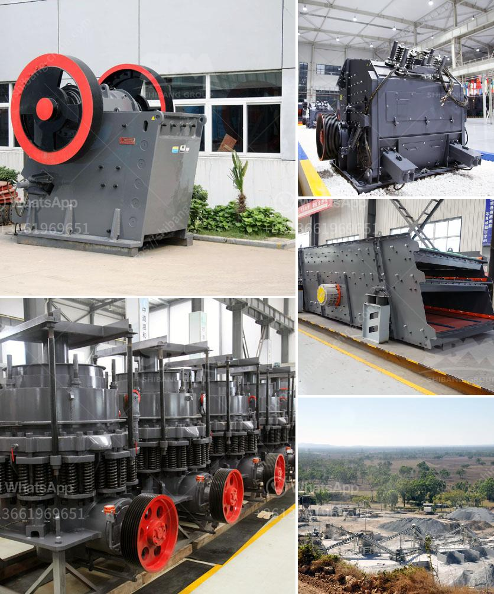

<h3>india 200 tpd cement plant cost</h3>
India has witnessed a rapid growth in the infrastructure sector in recent years. The country's demand for cement has increased exponentially, leading to the establishment of numerous cement plants. Among these, the 200 TPD cement plants are considered to be a viable option due to their operational efficiency and cost-effectiveness.

A 200 TPD cement plant is a small-scale production unit with the capacity to produce 200 tons of cement per day. Prominent manufacturers like Dalmia Cement, Bharathi Cement, and Shree Cement have set up such plants in different parts of the country to cater to the growing demand for cement.

The cost of setting up a 200 TPD cement plant in India can vary significantly depending on factors like location, machinery, availability of raw materials, labor, and market conditions. However, on average, the cost of setting up a plant of this capacity ranges from around INR 7-10 crores (approximately USD 1-1.4 million).

One of the major expenses in establishing a cement plant is the machinery required for the production process. A 200 TPD cement plant typically requires machinery such as crushers, mills, kiln, and packing machines, among others. The cost of these machinery components can range from INR 4-8 crores (approximately USD 0.5-1 million). It is essential to invest in high-quality machinery to ensure operational efficiency and minimize maintenance costs in the long run.

Furthermore, the availability and cost of raw materials play a crucial role in determining the overall cost of setting up a 200 TPD cement plant. Cement manufacturing requires limestone, clay, and other additives in specific proportions. The cost of procuring these raw materials can significantly impact the plant's total expenditure. It is advisable to locate the plant near limestone deposits to minimize transportation costs.

Labor is another important factor affecting the cost of a cement plant. India's labor market offers a competitive advantage due to the availability of skilled and semi-skilled workers at relatively lower wages. The cost of labor can vary depending on the region where the plant is located.

Market conditions also influence the cost of setting up a cement plant. Factors such as demand-supply dynamics, competition, and government policies can impact the profitability of the plant. It is crucial to conduct a thorough market analysis before making any investment decisions.

Despite the initial investment, setting up a 200 TPD cement plant offers various benefits. Firstly, it caters to the local demand, ensuring a steady supply of cement to the nearby areas. Additionally, it generates employment opportunities, contributing to the socio-economic development of the region.

In conclusion, setting up a 200 TPD cement plant in India involves a significant investment in machinery, raw materials, labor, and market research. The total cost can vary based on several factors, but it generally ranges from INR 7-10 crores (approximately USD 1-1.4 million). However, considering the growing demand for cement in India, this investment can lead to profitable returns and contribute to the country's infrastructure development.
<h3>Contact us</h3><ul><li><strong>Whatsapp:&nbsp;<a href="https://wa.me/8613661969651">+8613661969651</a></strong></li><li><a href="https://swt.shibang-china.com/?git&amp;zhl&amp;india 200 tpd cement plant cost"><strong>Online Service(chat now)</strong></a></li></ul><h3>Related</h3><ul><li><a href='vertical roller grinding mill for sale.md'>vertical roller grinding mill for sale</a></li><li><a href='application of hammer mill.md'>application of hammer mill</a></li><li><a href='vertical shaft impact crusher price.md'>vertical shaft impact crusher price</a></li><li><a href='diagram of stone crusher operation.md'>diagram of stone crusher operation</a></li><li><a href='crusher sale philippines.md'>crusher sale philippines</a></li></ul>