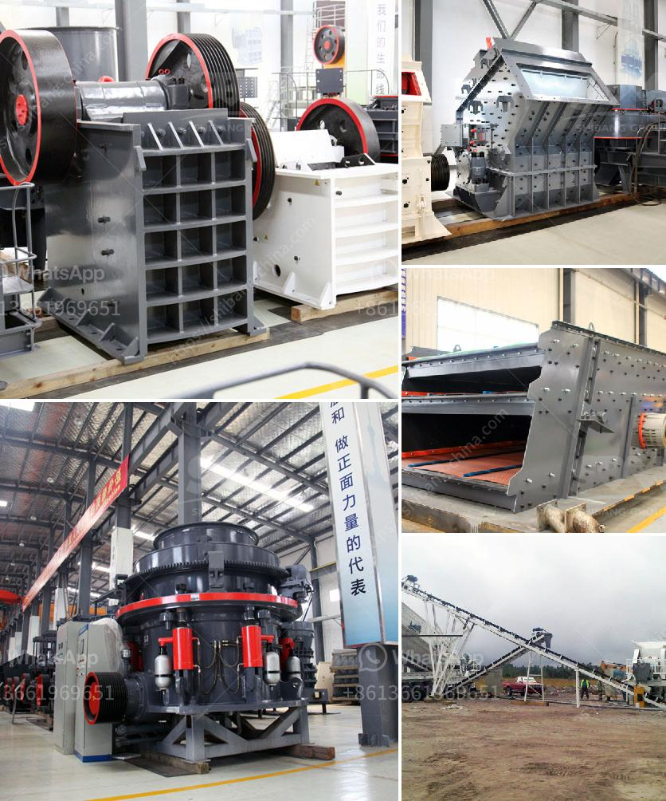

<h3>industrial crusher for sale</h3>
In today's modern world, industries are constantly on the lookout for innovative solutions to improve their production processes. One crucial aspect of manufacturing and construction industries is the efficient crushing of materials, which plays a significant role in various applications. Industrial crushers are specifically designed to break down large-sized materials into smaller, more manageable pieces, facilitating easy handling and reducing the overall transportation costs. With the growing demand for such equipment, there is a wide range of industrial crushers available in the market, each serving their unique purposes.

Industrial crushers are primarily used to reduce the size of raw materials for further processing or for end-use applications. These crushers are capable of handling a wide range of materials such as minerals, chemicals, coal, limestone, and even food items. The selection of the appropriate crusher depends on the nature of the material to be crushed, its hardness, moisture content, and particle size requirements.

One popular type of industrial crusher is the jaw crusher. It offers high crushing efficiency and reduces bulk materials for further processing. The jaw crusher consists of two vertical jaws placed opposite to each other and is equipped with a fixed jaw and a movable jaw. The material is fed into the crushing chamber through the top, where the jaws exert pressure to break it down into smaller pieces. The crushed material then exits through the bottom opening, ready for further processing.

Another commonly used industrial crusher is the cone crusher. This type of crusher is suitable for crushing various types of ores and rocks with medium to high hardness. The cone crusher uses a rotating cone to exert compression and crushing forces on the material, reducing it to a smaller size. It is widely used in industries such as mining, metallurgy, and building materials.

For industries requiring finer and more uniform particle sizes, impact crushers are the preferred choice. These crushers utilize impact forces to break down the material, resulting in a more controlled and uniform product. Impact crushers are suitable for a wide range of materials and can be used in both primary and secondary crushing applications.

When considering purchasing an industrial crusher, it is crucial to take into account factors such as the required capacity, power consumption, maintenance requirements, and overall operational costs. It is also essential to consider whether the crusher will be used in a stationary or mobile setting, as this will impact the selection and design of the equipment.

With the advancement of technology, modern industrial crushers offer better performance, increased efficiency, and improved safety features. Manufacturers are continuously researching and developing new solutions to meet the evolving needs of industries. As a result, there is a wide market of industrial crushers available for sale, offering a variety of options to cater to specific requirements.

In conclusion, industrial crushers play a vital role in various industries by efficiently reducing the size of raw materials. From jaw crushers to cone crushers and impact crushers, there are different types of crushers available for specific applications. When considering investing in an industrial crusher, it is crucial to evaluate the requirements and choose the right equipment that offers high crushing efficiency, durability, and cost-effectiveness. With the myriad of options available in the market, finding the perfect crusher for your business needs has never been easier.
<h3>Contact us</h3><ul><li><strong>Whatsapp:&nbsp;<a href="https://wa.me/8613661969651">+8613661969651</a></strong></li><li><a href="https://swt.shibang-china.com/?git&amp;zhl&amp;industrial crusher for sale"><strong>Online Service(chat now)</strong></a></li></ul><h3>Related</h3><ul><li><a href='manganese ore wash plant.md'>manganese ore wash plant</a></li><li><a href='marble quarry crusher equipments.md'>marble quarry crusher equipments</a></li><li><a href='industrial grinder in algeria.md'>industrial grinder in algeria</a></li><li><a href='coal vibration equipment size.md'>coal vibration equipment size</a></li><li><a href='cost of crushed concrete.md'>cost of crushed concrete</a></li></ul>