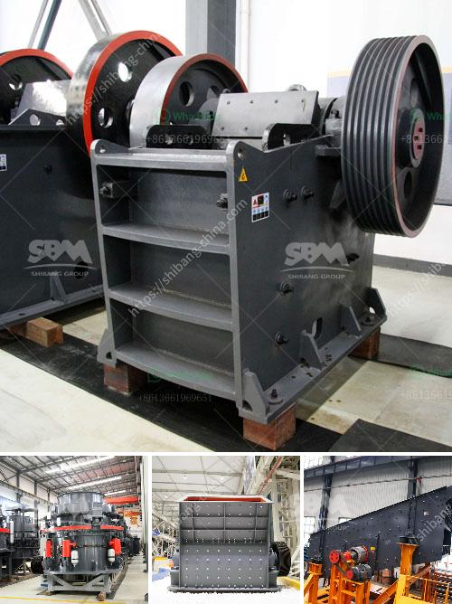

<h3>industrial fine powder grinder</h3>
Industrial fine powder grinders have revolutionized many industries by providing efficient and reliable grinding solutions. These machines are used to process a wide range of materials into finer powders, making them ideal for various applications such as pharmaceuticals, chemicals, food processing, and minerals.

One primary advantage of industrial fine powder grinders is their ability to produce a consistent and uniform particle size. This is crucial for many industries that require precise particle sizes to ensure quality and consistency in their products. Whether it is reducing the particle size of a pharmaceutical ingredient or grinding minerals into smaller particles for industrial use, these grinders can achieve the desired results consistently.

The fine powder grinders are equipped with powerful motors and cutting-edge technology, allowing them to handle high volumes of material efficiently. The grinding process is typically carried out in stages, starting with coarse grinding and gradually reducing the particle size until the desired fineness is achieved. This multi-stage process helps to prevent excessive heat buildup, ensuring that the material is not damaged during the grinding process.

Another significant advantage of industrial fine powder grinders is their versatility. These machines are designed to handle a wide range of materials, from soft and fibrous to hard and brittle. They can process materials such as herbs, spices, grains, resins, minerals, and even pharmaceutical ingredients with ease. The ability to grind various materials makes these grinders highly adaptable to different industries and applications.

Furthermore, industrial fine powder grinders are designed with safety in mind. They are equipped with safety features such as interlocking mechanisms and protective covers to prevent accidents and ensure operator safety. Additionally, these machines are built to withstand heavy-duty use and are made from durable materials to ensure longevity and reliability.

The efficiency of industrial fine powder grinders is also worth mentioning. These machines are designed to operate at high speeds, allowing for quick and efficient grinding. The high-quality blades and screens used in these grinders ensure a consistent and precise grind, minimizing waste and maximizing productivity. Additionally, the low maintenance requirements of these machines make them a cost-effective solution for many industries.

In conclusion, industrial fine powder grinders have become an integral part of many industries due to their efficiency, versatility, and reliability. They provide a consistent and uniform particle size, making them ideal for processing a wide range of materials. Their safety features and durability ensure long-term use, while their high-speed operation and low maintenance requirements make them an efficient and cost-effective solution for many businesses. Whether it is grinding pharmaceutical ingredients or processing minerals, these grinders offer a reliable and efficient grinding solution for various industrial applications.
<h3>Contact us</h3><ul><li><strong>Whatsapp:&nbsp;<a href="https://wa.me/8613661969651">+8613661969651</a></strong></li><li><a href="https://swt.shibang-china.com/?git&amp;zhl&amp;industrial fine powder grinder"><strong>Online Service(chat now)</strong></a></li></ul><h3>Related</h3><ul><li><a href='three roll milling italy.md'>three roll milling italy</a></li><li><a href='buy stone crusher machine in saudi arabia.md'>buy stone crusher machine in saudi arabia</a></li><li><a href='philippines stone crusher philippines.md'>philippines stone crusher philippines</a></li><li><a href='mining rental equipment south africa.md'>mining rental equipment south africa</a></li><li><a href='second hand equipment for sale in south africa.md'>second hand equipment for sale in south africa</a></li></ul>