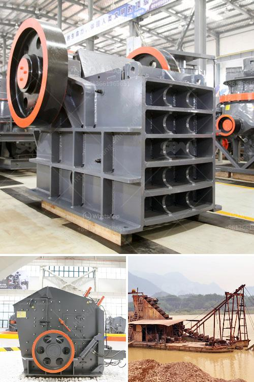

<h3>industrial grinder in algeria</h3>
Industrial grinders play a crucial role in many industries in Algeria. These powerful machines are designed to grind and smooth surfaces, removing excess material and creating a finished product. From metalworking to construction, industrial grinders are essential for enhancing productivity and accuracy in various applications.

Algeria, being a developing country, has witnessed an increase in construction activities in recent years. The demand for industrial grinders has subsequently risen, as they are extensively used in the construction industry. These grinders are employed for various tasks, such as removing old paint, grinding concrete surfaces, and polishing floors. With their efficiency and versatility, industrial grinders save significant time and effort while producing high-quality results.

Additionally, industries such as manufacturing and metalworking heavily rely on industrial grinders to refine their products. These grinders are instrumental in shaping and polishing metal surfaces, resulting in precise and smooth finishes. They are also used for removing welding splatters and burrs, ensuring that the products meet industry standards.

One of the significant advantages of industrial grinders in Algeria is their ability to handle tough materials. Whether it is grinding concrete, cutting through granite, or polishing metal surfaces, these machines are equipped with robust blades and discs to handle the challenging tasks efficiently.

Industrial grinders in Algeria come in various types and sizes to cater to different application needs. For instance, angle grinders are compact and versatile, suitable for smaller projects and hard-to-reach areas. Bench grinders, on the other hand, are stationary and provide a stable platform for precision grinding.

As Algerian industries continue to grow, the demand for industrial grinders is expected to rise further. With advancements in technology, these machines are becoming more efficient, user-friendly, and environmentally friendly. Manufacturers are incorporating features such as dust collection systems and ergonomic designs to enhance safety and productivity.

In conclusion, industrial grinders play a pivotal role in Algeria's industries, particularly in construction, manufacturing, and metalworking. These robust machines provide efficient and precise grinding, polishing, and shaping of various materials. As Algeria progresses towards economic development, the demand for industrial grinders is likely to increase, leading to further advancements in this technology.
<h3>Contact us</h3><ul><li><strong>Whatsapp:&nbsp;<a href="https://wa.me/8613661969651">+8613661969651</a></strong></li><li><a href="https://swt.shibang-china.com/?git&amp;zhl&amp;industrial grinder in algeria"><strong>Online Service(chat now)</strong></a></li></ul><h3>Related</h3><ul><li><a href='vertical cement grinding mill from 10 20 tph.md'>vertical cement grinding mill from 10 20 tph</a></li><li><a href='iron ore pellet plant in odisha.md'>iron ore pellet plant in odisha</a></li><li><a href='quarry crusher philippines.md'>quarry crusher philippines</a></li><li><a href='three roll milling italy.md'>three roll milling italy</a></li><li><a href='portable stone crusher machine in philippines.md'>portable stone crusher machine in philippines</a></li></ul>