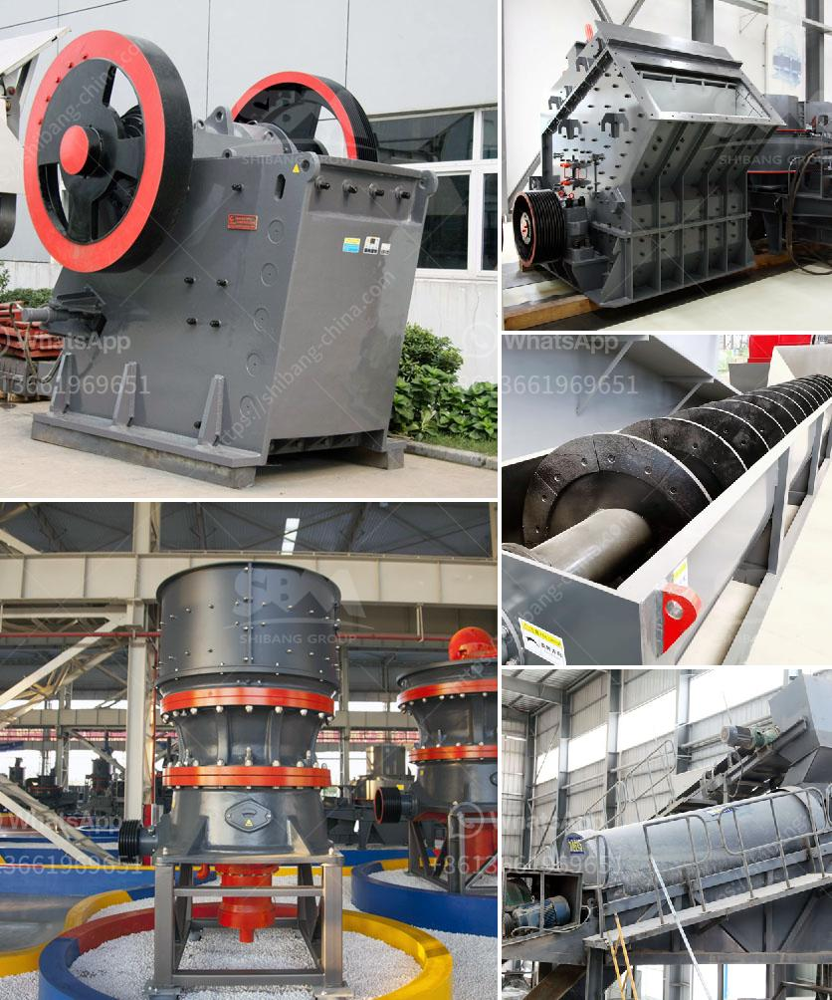

<h3>industrial limestone crusher</h3>
An industrial limestone crusher is mainly used in the primary crushing stage in industries like mining, construction, and chemical industries. It is used to crush large limestone into smaller particles for further processing. In the mining industry, an industrial limestone crusher is used to reduce the size of ore blocks before grinding to facilitate the subsequent separation process.

The industrial limestone crusher is designed with a unique cavity and feeding principle, which improves its processing capacity. Due to its large feed opening and high crushing ratio, it can crush large limestone into smaller particles with uniform size and high efficiency. The industrial limestone crusher also has low energy consumption and low operating costs, which further brings great benefits to the users.

In terms of environmental protection, the industrial limestone crusher is equipped with a dust removal device, which can effectively reduce dust pollution. The design of the sealing structure also eliminates the leakage of dust and prevents environmental pollution. Moreover, the industrial limestone crusher has a noise reduction device, which can effectively reduce noise pollution.

In conclusion, an industrial limestone crusher is a necessary equipment in the mining industry. It can be used to crush large limestone into smaller particles for further processing. It has the advantages of high processing capacity, low energy consumption, and low operating costs. With the dust removal device and noise reduction device, it also effectively reduces environmental pollution. Overall, the industrial limestone crusher plays a crucial role in improving productivity and reducing environmental impact in various industries.
<h3>Contact us</h3><ul><li><strong>Whatsapp:&nbsp;<a href="https://wa.me/8613661969651">+8613661969651</a></strong></li><li><a href="https://swt.shibang-china.com/?git&amp;zhl&amp;industrial limestone crusher"><strong>Online Service(chat now)</strong></a></li></ul><h3>Related</h3><ul><li><a href='crusher sand and stone in kenya.md'>crusher sand and stone in kenya</a></li><li><a href='kenya cement plant.md'>kenya cement plant</a></li><li><a href='pebble crushing production line.md'>pebble crushing production line</a></li><li><a href='automated roller conveyors.md'>automated roller conveyors</a></li><li><a href='komatsu crawler crusher.md'>komatsu crawler crusher</a></li></ul>