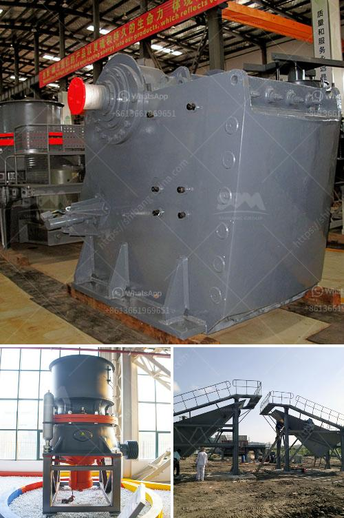

<h3>industrial pulverizing ball mill</h3>
The industrial pulverizing ball mill has a crucial role in the cement and mining industries. It has been widely used in the crushing of materials in the cement and mining industries due to its high efficiency and energy-saving characteristics. The grinding media in the ball mill crushes and grinds the raw material, contributing to the economic value of the mill.

Depending on the application, the ball mill can be divided into dry or wet grinding. Different industries have different approaches for grinding ores in their milling process. To avoid contamination, the grinding chamber can be lined with ceramic or rubber materials. This prevents contamination of the product by the iron from the grinding media.

A ball mill works on the principle of impact and attrition: size reduction is done by impact as the balls drop from near the top of the shell. A ball mill consists of a hollow cylindrical shell rotating about its axis. The axis of the shell may be either horizontal or at a small angle to the horizontal. It is partially filled with balls. The grinding media is the balls, which may be made of steel, stainless steel, ceramic, or rubber.

The ball mill is a key equipment extensively used for grinding crushed materials in production lines for powders such as cement, fertilizer, refractory material, silicates, glass ceramics as well as for ore dressing of both, black and non-ferrous metals. The ball mill can grind various ores and other materials either wet or dry.

There are two kinds of ball mill, grate type and overfall type due to different ways of discharging material. There are many types of grinding media suitable for use in a ball mill, each material having its own specific properties and advantages.

Key properties of grinding media are size, density, hardness, and composition. The final particle size distribution is directly dependent on the grinding media used. As the grinding media wears, fine enough material is accumulated to provide sufficient impact for further grinding.

The action of these impacts and attritions makes efficient grinding of hard materials, such as cement clinker, possible. The impact energy of the grinding ball is freely adjustable, thus allowing it to be easily adapted for various sectors and applications. It is also well suited for universal applications, including mixing, homogenizing, and mechanical alloying.

In conclusion, the industrial pulverizing ball mill has been widely used in the mining and cement industries due to its high efficiency and energy-saving characteristics. It has become an essential equipment in these industries.
<h3>Contact us</h3><ul><li><strong>Whatsapp:&nbsp;<a href="https://wa.me/8613661969651">+8613661969651</a></strong></li><li><a href="https://swt.shibang-china.com/?git&amp;zhl&amp;industrial pulverizing ball mill"><strong>Online Service(chat now)</strong></a></li></ul><h3>Related</h3><ul><li><a href='grinding roller mill machine.md'>grinding roller mill machine</a></li><li><a href='jaw crusher engine and complete set.md'>jaw crusher engine and complete set</a></li><li><a href='mobile crushers in abuja.md'>mobile crushers in abuja</a></li><li><a href='small scale marble crushing and processing industery.md'>small scale marble crushing and processing industery</a></li><li><a href='stone crusher suppliers in indore.md'>stone crusher suppliers in indore</a></li></ul>