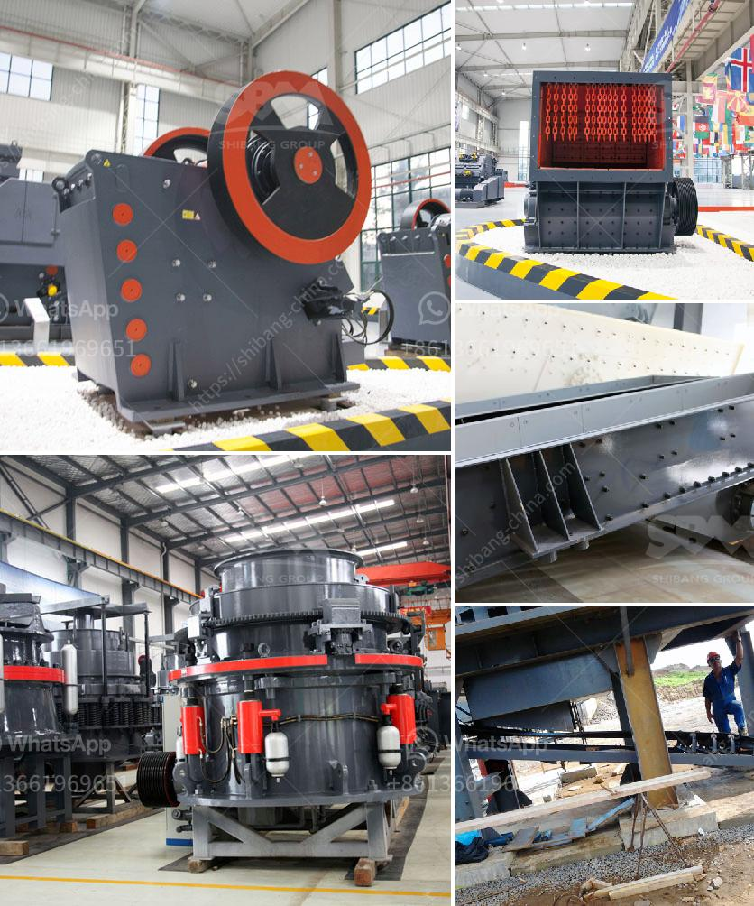

<h3>industrial roller mill</h3>
The industrial roller mill is a highly efficient equipment used for the grinding and processing of solid materials. It plays a crucial role in many industries, including mining, agriculture, food, and chemicals. This powerful tool operates by crushing and grinding materials between heavy rollers that rotate at various speeds.

One of the key advantages of the industrial roller mill is its ability to handle a wide range of materials. Whether it is minerals, ores, grains, or other solid substances, this mill can effectively break them down to smaller, more manageable sizes. This versatility makes it an essential piece of machinery for industries that require particle size reduction.

In addition to its versatility, the industrial roller mill offers exceptional performance and efficiency. It is designed to process large quantities of material quickly, reducing the need for multiple grinding machines. Its robust construction ensures durability and longevity, making it a cost-effective investment for businesses.

Another benefit of the industrial roller mill is its ease of operation and maintenance. With simple controls and minimal moving parts, it is user-friendly and requires minimal training. Additionally, routine maintenance tasks are straightforward, ensuring minimal downtime and maximum productivity.

Furthermore, the industrial roller mill can be customized to meet specific requirements. Different roller materials, sizes, and configurations can enhance performance and achieve desired particle sizes. This flexibility allows industries to optimize their processes and maximize output.

In conclusion, the industrial roller mill is a versatile and efficient tool that plays a critical role in various industries. Its ability to handle a wide range of materials, exceptional performance, ease of operation, and customization options make it an indispensable asset for businesses. As technology continues to advance, the industrial roller mill will undoubtedly evolve and cater to the demands of the ever-changing industrial landscape.
<h3>Contact us</h3><ul><li><strong>Whatsapp:&nbsp;<a href="https://wa.me/8613661969651">+8613661969651</a></strong></li><li><a href="https://swt.shibang-china.com/?git&amp;zhl&amp;industrial roller mill"><strong>Online Service(chat now)</strong></a></li></ul><h3>Related</h3><ul><li><a href='activated carbon crushing machine czech republic.md'>activated carbon crushing machine czech republic</a></li><li><a href='pulverizer crusher manufacturer in pune.md'>pulverizer crusher manufacturer in pune</a></li><li><a href='coal machinery for coal processing crusher.md'>coal machinery for coal processing crusher</a></li><li><a href='crushers for sale in uae.md'>crushers for sale in uae</a></li><li><a href='mini crusher for gravel.md'>mini crusher for gravel</a></li></ul>