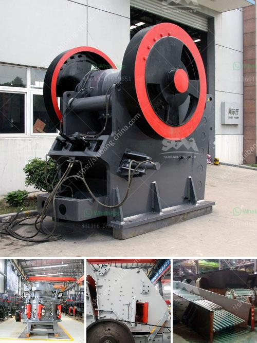

<h3>iron mining machine manufacturer</h3>
The process of extracting iron from the earth is not an easy task. It requires heavy machinery, specialized equipment, and skilled workers to ensure efficient and safe iron mining operations. This is where iron mining machine manufacturers play a crucial role by providing the mining industry with innovative and reliable equipment.

Iron mining machine manufacturers design and develop machinery to handle the various stages of iron extraction. From drilling machines that dig deep into the earth to crushers and screens that sort and separate the extracted iron ore, these manufacturers offer a comprehensive range of equipment to facilitate efficient mining processes.

One such reputable iron mining machine manufacturer is XYZ Machinery. With years of experience and expertise in the field, XYZ Machinery has become a leading provider of mining equipment for iron ore operations worldwide. Their range of machines includes drilling rigs, excavators, haul trucks, and crushers, all designed to maximize productivity and ensure optimal ore recovery.

What sets XYZ Machinery apart from other manufacturers is their commitment to innovation. They continually invest in research and development to create groundbreaking technologies that address the challenges faced by iron mining companies. By integrating advanced automation systems, XYZ Machinery's machines optimize performance, reduce downtime, and ensure worker safety.

Additionally, iron mining machine manufacturers like XYZ Machinery focus on sustainability. They develop eco-friendly equipment with lower emissions, energy-efficient technologies, and improved waste management systems. By implementing such practices, they aim to reduce the environmental impact of mining operations.

The collaboration between iron mining machine manufacturers like XYZ Machinery and mining companies has led to significant advancements in the industry. These manufacturers understand the unique needs and challenges faced by mining operations and work tirelessly to provide tailored solutions.

In conclusion, iron mining machine manufacturers play a crucial role in the mining industry by providing innovative and reliable equipment. Their dedication to research, development, and sustainability contributes to improved productivity, efficiency, and environmental responsibility in iron mining operations. As the demand for iron continues to rise, these manufacturers will continue to provide cutting-edge solutions, ensuring a sustainable and prosperous future for the mining industry.
<h3>Contact us</h3><ul><li><strong>Whatsapp:&nbsp;<a href="https://wa.me/8613661969651">+8613661969651</a></strong></li><li><a href="https://swt.shibang-china.com/?git&amp;zhl&amp;iron mining machine manufacturer"><strong>Online Service(chat now)</strong></a></li></ul><h3>Related</h3><ul><li><a href='gold wash plant machine in ghana.md'>gold wash plant machine in ghana</a></li><li><a href='how pyrite mined and processed.md'>how pyrite mined and processed</a></li><li><a href='calcite grinding machine manufacturer in udaipur.md'>calcite grinding machine manufacturer in udaipur</a></li><li><a href='stone crusher machine price in uganda.md'>stone crusher machine price in uganda</a></li><li><a href='sand making machine price.md'>sand making machine price</a></li></ul>