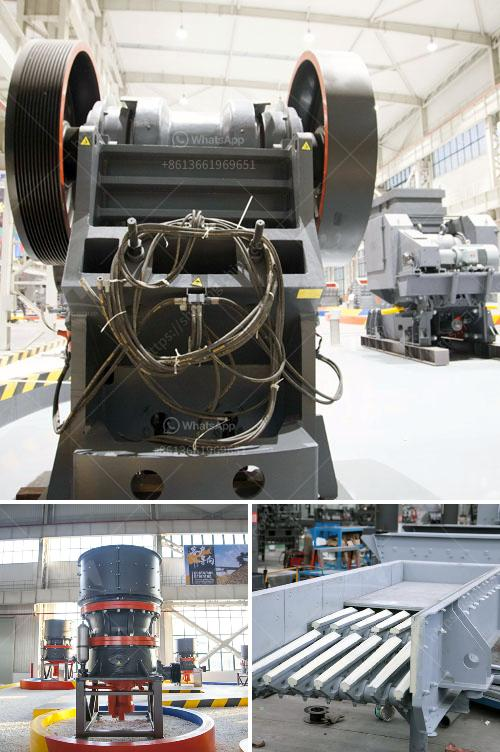

<h3>iron ore crusher in mexico</h3>
Mexico is rich in mineral resources, especially in iron ore deposits. Iron ore cone crusher is one of the most high efficiency iron ore crusher. Comparing with other iron crusher, iron ore cone crusher with high-efficiency has excellences for iron ore crushing, high productions and low maintenance. The long force arm designed into the cone provides greater iron ore crushing force. France Iron ore mobile crusher is developed according to novel series iron ore crushing equipment’s design idea, which expands the concept field of coarse crushing and fine crushing.Our Iron Ore Crusher in Mexico are of great quality and comparative price. The iron ore crushing plant production line produced by our company can provide you with all-around technical support. The whole iron ore crushing plant consists of vibrating feeder, jaw crusher, cone crusher, impact crusher, vibrating screen and belt conveyor. According to different technical requirements, we can also design iron ore crushing plant with different capacity ranging from 30 to 1000 tph. Our Iron Ore Crusher in Mexico all have a stable and complete operation, which is favored by many users. In the field of crushing, the processing of iron ore is a process requiring strong technical support, and we have a high level of technical support in the production of iron ore crushers in Mexico.

Mexico's iron ore resources are very rich, its reserves are among the world's highest and most abundant. According to the Mexican Ministry of Economy's forecast, Mexico's proven iron ore reserves are about 1.9 billion tons, mainly located in the Guerrero, Colima, Jalisco, Michoacán, Nayarit, and Sinaloa states. The Mexican iron ore is mainly distributed in these states and has played an important role in the national economy and development.

With the increasing demand for iron ore in the international market, Mexico has strengthened the exploration of iron ore resources in recent years. Many large-scale iron ore mines have been put into production, which has greatly promoted the development of Mexico's iron ore crusher industry. Mexico's iron ore crushers are low in price and excellent in quality, and the sales volume exceeds other countries. In addition to the Mexican Iron Ore Crusher, Bridge construction, water conservancy and hydropower, etc. industries’ use it as a fine crusher, too. The finished product is cube-shaped, with excellent grain shape, reasonable gradation and adjustable fineness modulus. It is particularly suitable for artificial sand making and stone shaping.

Mexico is rich in iron ore resources and there are more than 400 known deposits. With more and more mining investment in Mexico, the mining machinery operators, in order to improve the production capacity and expand the range of mineral applications, have purchased various types of heavy mining equipment.

In the field of mining machinery, the global iron ore crushers market size in 2020 stood at USD 1.93 billion. The leading factors enabling growth in this market are the increasing demand for iron ore globally, rising production of iron ore due to environmental constraints, and the growing need for minerals in various end-use industries, such as construction, power & energy, and manufacturing.

In conclusion, Mexico's iron ore resources are abundant and high in quality. Besides, iron ore cone crusher is usually used for crushing iron ore, and it is the most suitable industrial machinery for crushing iron ore. With the continuous development of the industry, the iron ore crushers have been committed to the development of more advanced technology and equipment, along with the growth of the iron ore production needs. Therefore, Mexico is a promising country for the future development of iron ore crusher industry.
<h3>Contact us</h3><ul><li><strong>Whatsapp:&nbsp;<a href="https://wa.me/8613661969651">+8613661969651</a></strong></li><li><a href="https://swt.shibang-china.com/?git&amp;zhl&amp;iron ore crusher in mexico"><strong>Online Service(chat now)</strong></a></li></ul><h3>Related</h3><ul><li><a href='high energy ball mill.md'>high energy ball mill</a></li><li><a href='limestone production equipment.md'>limestone production equipment</a></li><li><a href='harga stone crusher 250 ton.md'>harga stone crusher 250 ton</a></li><li><a href='stone crusher machine tutorials.md'>stone crusher machine tutorials</a></li><li><a href='gypsum board plant initial investment.md'>gypsum board plant initial investment</a></li></ul>