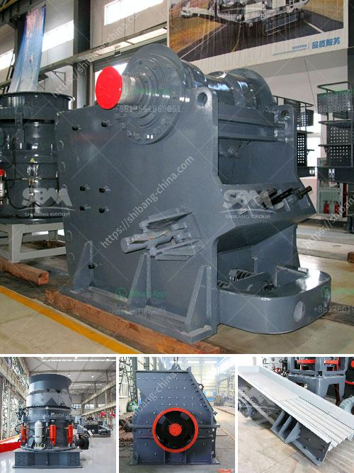

<h3>iron ore crushing equipment cost</h3>
Iron ore is the key raw material for steel production enterprises. The iron ore market depends on global industrial and economic developments, and its price directly affects steel prices. In recent years, due to rises in steel production capacity, the demand for iron ore has increased significantly.

With the continuous development of infrastructure construction, the demand for iron ore is also increasing. To meet this demand, iron ore crushing equipment is essential. During the processing of iron ore, a large amount of crushing equipment is needed to crush the iron ore into proper sizes. This not only improves the efficiency of iron ore crushing, but also reduces the cost of iron ore crushing.

The iron ore crushing equipment cost includes the design, manufacture, installation, energy consumption, and maintenance. The selection of the iron ore crushing equipment mainly depends on the characteristics of the raw materials. The iron ore market constantly adjusts its product specifications. For example, the iron ore particle size requirements are becoming more and more strict, and the mineral processing equipment manufacturers need to improve themselves to meet market demand.

Although the cost of iron ore crushing equipment is high overall, the initial investment in iron ore crushing production line is relatively low. It only needs to purchase a set of iron ore crushing equipment, which can meet the production needs of most small and medium-sized iron ore processing plants. For large-scale iron ore processing plants, multiple crushing equipment can be purchased.

In conclusion, the cost of iron ore crushing equipment depends on the selection of equipment, production capacity, economic benefits, and other factors. Iron ore crushing equipment cost is reasonable and is generally accepted by investors. We believe that with the further development of the market, the cost of iron ore crushing equipment will gradually decrease, making it more affordable for users.
<h3>Contact us</h3><ul><li><strong>Whatsapp:&nbsp;<a href="https://wa.me/8613661969651">+8613661969651</a></strong></li><li><a href="https://swt.shibang-china.com/?git&amp;zhl&amp;iron ore crushing equipment cost"><strong>Online Service(chat now)</strong></a></li></ul><h3>Related</h3><ul><li><a href='quartz powder machine.md'>quartz powder machine</a></li><li><a href='jaw crushers price south africa.md'>jaw crushers price south africa</a></li><li><a href='white cement plant machinery manufacturers.md'>white cement plant machinery manufacturers</a></li><li><a href='turkey plant production line of gypsum powder.md'>turkey plant production line of gypsum powder</a></li><li><a href='cone crusher suppliers.md'>cone crusher suppliers</a></li></ul>