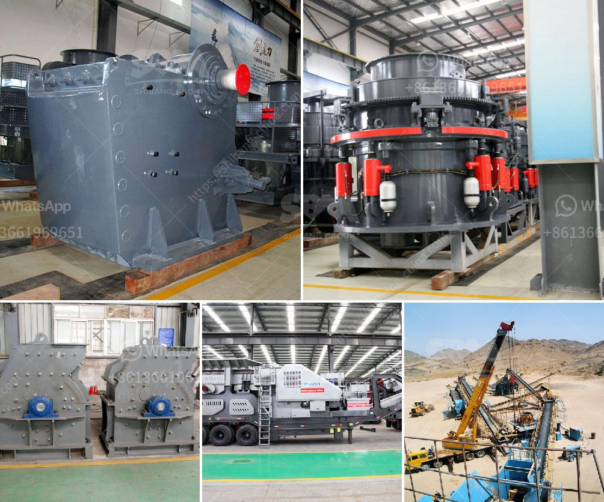

<h3>iron ore grinding ball mill details</h3>
Iron ore is a crucial ingredient in the production of steel, one of the most commonly used construction materials in the world. In order to produce iron ore, it needs to be crushed and ground down to a fine particle size, which is where ball mills come in.

Using grinding balls to help crush the ore is a common practice in many industries, including metallurgical plants, cement plants, power plants, and more. Ball mills are used for grinding materials such as coal, pigments, and feldspar for pottery. Grinding can be carried out either wet or dry, but the former is performed at low speed.

A ball mill typically consists of a cylindrical shell that rotates on a horizontal axis, partially filled with grinding media such as ceramic or steel balls. The material to be ground is loaded into the shell and as the mill rotates, the grinding media crushes and grinds the material.

The grinding media in a ball mill can be made of various materials, including ceramic, steel, and chrome steel. It is critical that the grinding media is able to withstand the corrosive properties of the ore being ground. High-carbon steel balls are commonly used for this purpose, as they are hard enough to crush the ore into fine particles, but also durable enough to withstand the corrosive environment of the mill.

The size and composition of the grinding media can greatly affect the efficiency of the mill and the final particle size of the ground material. Different mills require different sizes of grinding media, and it is important to choose the right size and composition to achieve the desired results.

The ball mill operates by rotating a cylinder with grinding balls, like steel, CI, ceramic, and pebble balls, as grinding media. Material fed through the mill is crushed by impact and grounded through attrition between the balls. Continuous grinding is ensured in a two-chamber closed-circuit mill by a reversing spiral, which allows a high circulation of balls and coarse material. The adjustable diaphragm separates the chambers and adjusts the material level to achieve the desired fineness.

The grinding balls in a ball mill are usually made of steel or other hardened materials. By subjecting the balls to repeated impacts and attrition between the balls, the ore particles are reduced in size. Smaller particles are then released from the grinding media and discharged into a collection system for further processing.

In conclusion, ball mills are essential machines for grinding iron ore into fine particles. They are widely used in many industries and play a crucial role in the production of steel. The size and composition of the grinding media are important factors to consider when choosing a ball mill for iron ore grinding.
<h3>Contact us</h3><ul><li><strong>Whatsapp:&nbsp;<a href="https://wa.me/8613661969651">+8613661969651</a></strong></li><li><a href="https://swt.shibang-china.com/?git&amp;zhl&amp;iron ore grinding ball mill details"><strong>Online Service(chat now)</strong></a></li></ul><h3>Related</h3><ul><li><a href='kenya regular impact crusher.md'>kenya regular impact crusher</a></li><li><a href='gold milling machine for sale in south africa.md'>gold milling machine for sale in south africa</a></li><li><a href='crusher machine distributor in zambia.md'>crusher machine distributor in zambia</a></li><li><a href='crusher plant layout.md'>crusher plant layout</a></li><li><a href='hammer mill sale in malaysia.md'>hammer mill sale in malaysia</a></li></ul>