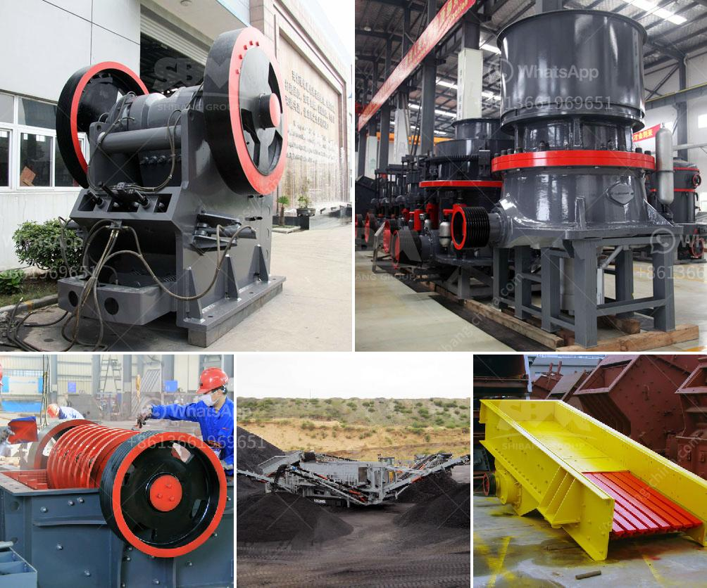

<h3>iron ore pellet plant in odisha</h3>
Iron ore pellet plants in Odisha, India, have been a key component in boosting the state's economy and meeting the increasing demand for iron ore pellets worldwide. These plants have become an integral part of the iron ore supply chain, providing a reliable source of high-quality pellets to domestic and international markets.

Odisha, located on the eastern coast of India, is endowed with vast reserves of iron ore. These reserves have been a driving force behind the establishment of iron ore pellet plants in the state. The pellet plants enable the conversion of low-grade iron ore fines into value-added pellets, which are more suitable for use in blast furnaces and direct reduction processes.

The iron ore pellet plants in Odisha are equipped with state-of-the-art technology and machinery to produce high-grade pellets. The plants employ advanced beneficiation techniques to upgrade the iron ore fines, ensuring the production of pellets with high iron content and low impurities. This makes them highly desirable in the global market.

The establishment of these pellet plants has had a significant impact on the local economy. They have generated employment opportunities for the local population, both directly and indirectly. The construction and operation of these plants have created jobs in various sectors such as engineering, manufacturing, logistics, and maintenance. Additionally, the demand for ancillary goods and services has also increased, leading to further economic growth in the region.

The presence of iron ore pellet plants in Odisha has also resulted in increased revenue for the state government. The plants pay taxes and royalties on the iron ore extracted and the pellets produced. This revenue is used for various developmental projects, improving infrastructure, and providing better facilities to the local population.

Furthermore, these pellet plants have contributed to the growth of the steel industry in India. The supply of high-quality pellets has ensured a steady and reliable source of raw material for steel manufacturers. This has not only reduced the dependence on imported iron ore but has also helped in cost optimization and process efficiency for the steel producers.

The success of iron ore pellet plants in Odisha can be attributed to the favorable business environment and support from the state government. The government has provided various incentives and concessions to attract investments in the sector. This has encouraged both domestic and international players to set up pellet plants, further boosting the economic growth of the state.

In conclusion, iron ore pellet plants in Odisha have played a crucial role in enhancing the state's economy and meeting the growing demand for high-quality iron ore pellets. These plants have created employment opportunities, generated revenue for the state, and contributed to the growth of the steel industry. With the continued support from the government and advancements in technology, the pellet plants in Odisha are expected to witness further expansion and drive sustainable development in the region.
<h3>Contact us</h3><ul><li><strong>Whatsapp:&nbsp;<a href="https://wa.me/8613661969651">+8613661969651</a></strong></li><li><a href="https://swt.shibang-china.com/?git&amp;zhl&amp;iron ore pellet plant in odisha"><strong>Online Service(chat now)</strong></a></li></ul><h3>Related</h3><ul><li><a href='sand making machine suppliers in south africa.md'>sand making machine suppliers in south africa</a></li><li><a href='copper crusher machine.md'>copper crusher machine</a></li><li><a href='ball mills for large mining.md'>ball mills for large mining</a></li><li><a href='ball mill machine price.md'>ball mill machine price</a></li><li><a href='rubble crushing machine.md'>rubble crushing machine</a></li></ul>