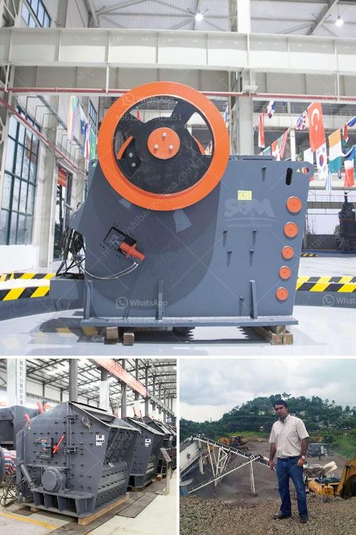

<h3>iron ore processing equipment</h3>
Iron ore refers to the rocks from which metallic iron is extracted. Iron ore is a mineral substance which, when heated in the presence of a reductant, will yield metallic iron (Fe). The iron ore is usually rich in iron oxides which vary in color from dark grey, bright yellow, deep purple, to rusty red. Iron ore processing equipment is a great investment because of the grade of iron ores being mined has declined and predictive models indicate lower iron ore content.

As a result, processing plants have been put in place to extract the valuable iron from the waste material. Although iron ore is rich in iron oxides, the iron content varies greatly depending on the ore quality. Additionally, the processing techniques differ in the levels of impurities present in the ore. There are various equipment used in the iron ore processing workflow.

Firstly, crushers are used to break down the large iron ore rocks into smaller pieces. The iron ore is then crushed and screened to a size suitable for batching or pelletizing. Crushers are the first stage of the crushing process, reducing rocks to a manageable size. Often, the crushers are followed by autogenous mills which grind ore directly into fine particles.

Next, magnetic separation equipment is used to remove impurities in the iron ore. This process uses magnetic fields to separate magnetic materials from non-magnetic ones. Magnetic separators can be either permanent or electromagnets. The magnetic separator separates iron ore particles from gangue minerals by utilizing the difference in magnetic susceptibilities between the ore minerals and the impurities.

After magnetic separation, the iron ore undergoes grinding and flotation processes. Grinding is the final stage in the comminution process and achieves final liberation of the valuable minerals. Grinding mills and comminution devices utilize impact, compression, and attrition for reducing ore size. The purpose of grinding is to produce a uniform particle size distribution to prevent over-grinding and improve downstream separation processes.

Flotation is a separation process in which valuable minerals are separated from gangue minerals using hydrophobicity and hydrophilicity properties. In the iron ore flotation process, collectors, frothers, and modifiers are added to the slurry to facilitate the separation of valuable minerals from gangue minerals. The ore slurry is then subjected to a series of flotation cells where the minerals attach to air bubbles and are floated to the surface.

Lastly, dewatering equipment is used to remove water from the iron ore concentrate. This is typically done through filtration or thickening processes. Filtration separates solids from liquids, while thickening increases the concentration of solids in the slurry. Dewatering equipment plays a crucial role in reducing the moisture content of the iron ore concentrate before it can be transported and used in various applications.

In conclusion, iron ore processing equipment is essential to the iron ore mining and beneficiation process. It ensures the efficient removal of impurities and a higher ore grade. When utilized correctly, iron ore processing equipment can be highly-efficient and cost-effective, resulting in a profitable iron ore beneficiation process.
<h3>Contact us</h3><ul><li><strong>Whatsapp:&nbsp;<a href="https://wa.me/8613661969651">+8613661969651</a></strong></li><li><a href="https://swt.shibang-china.com/?git&amp;zhl&amp;iron ore processing equipment"><strong>Online Service(chat now)</strong></a></li></ul><h3>Related</h3><ul><li><a href='mining equipment in turkey.md'>mining equipment in turkey</a></li><li><a href='stone jaw crusher machine.md'>stone jaw crusher machine</a></li><li><a href='gravel pebbles mining south africa.md'>gravel pebbles mining south africa</a></li><li><a href='equipment costs for cement plant.md'>equipment costs for cement plant</a></li><li><a href='vertical cement grinding mill from 10 20 tph.md'>vertical cement grinding mill from 10 20 tph</a></li></ul>