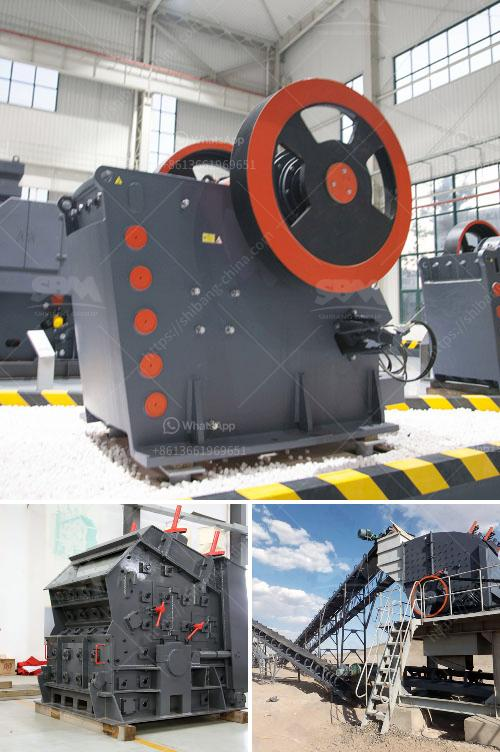

<h3>iron sand arator in philippines</h3>
The Philippines is rich in mineral resources, making it a prime location for mining activities. As such, it is essential for mining companies to utilize effective equipment to extract and process valuable minerals efficiently. One indispensable tool in the mining industry is the iron sand separator, which plays a crucial role in separating iron-rich materials from other sediments.

Iron sand, also known as magnetite sand, is a magnetic black mineral abundant in the Philippines. It is derived from volcanic activity and is found mainly in coastal regions. Due to its high iron content, it is desirable for use in steel production and various other applications. However, separating iron sand from other sediments can be a complex and tedious process.

This is where the iron sand separator comes into play. The machine utilizes magnetic separation technology to separate iron particles from non-magnetic materials, making it an efficient and cost-effective solution for mining operations. The iron sand separator works by passing a stream of sand through a magnetic field generated by a powerful magnet. As the sand passes through the magnetic field, the iron particles are attracted to the magnet and separated from the rest of the sediments.

One of the primary advantages of the iron sand separator is its ability to recover high-purity iron sand. The separated iron particles can be further processed and used in various industries, including steel manufacturing, iron ore smelting, and even in the production of high-quality concrete. This not only enhances the economic value of the extracted iron sand but also reduces the environmental impact of mining activities by maximizing resource utilization.

Furthermore, the iron sand separator is known for its versatility, as it can be easily adjusted to accommodate varying grades and sizes of iron sand. This flexibility allows mining companies to optimize their operations and maximize the recovery of valuable minerals. Additionally, the iron sand separator's compact design and ease of operation make it suitable for both large-scale mining operations and smaller and artisanal mining activities.

In the Philippines, where mining plays a significant role in the economy, the iron sand separator has proven to be an invaluable tool for mining companies. It streamlines the extraction process, reduces the need for manual labor, and increases overall productivity. Moreover, the utilization of iron sand separator technology contributes to sustainable mining practices, as it enables efficient resource extraction and minimizes waste production.

However, it is important to note that the use of iron sand separators should be accompanied by responsible mining practices and strict adherence to environmental regulations. Mining operations must prioritize the protection of the environment and ensure the rehabilitation of affected areas. Additionally, investing in research and development to improve the efficiency and effectiveness of iron sand separators will help further optimize mining operations and minimize potential environmental impacts.

In conclusion, the iron sand separator is an indispensable tool for mining operations in the Philippines. Its ability to separate iron-rich materials from other sediments enhances resource utilization and contributes to sustainable mining practices. As the mining industry continues to expand, the importance of innovative technologies like the iron sand separator cannot be underestimated, as they enable efficient and responsible resource extraction.
<h3>Contact us</h3><ul><li><strong>Whatsapp:&nbsp;<a href="https://wa.me/8613661969651">+8613661969651</a></strong></li><li><a href="https://swt.shibang-china.com/?git&amp;zhl&amp;iron sand arator in philippines"><strong>Online Service(chat now)</strong></a></li></ul><h3>Related</h3><ul><li><a href='stone jaw crusher machine.md'>stone jaw crusher machine</a></li><li><a href='cone crushers made in italy.md'>cone crushers made in italy</a></li><li><a href='kaolin grinding mill.md'>kaolin grinding mill</a></li><li><a href='crushers and grinders mill.md'>crushers and grinders mill</a></li><li><a href='calcite production plant.md'>calcite production plant</a></li></ul>