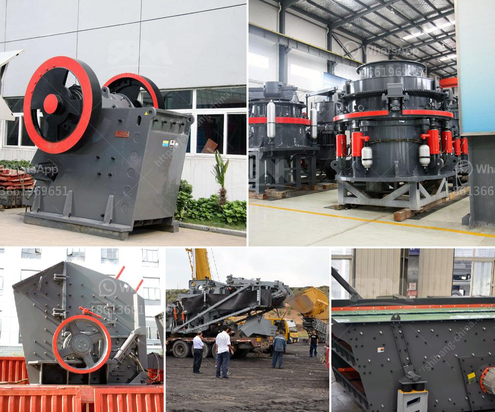

<h3>iron slag crusher india</h3>
Iron slag is a by-product of iron and steel production, generated during the smelting process. It is a non-metallic material consisting of minerals and compounds that are mechanically separated from the iron ore concentrate. While the iron slag is a valuable and sustainable material, it poses environmental challenges in terms of storage and disposal. To tackle this issue, the use of iron slag crusher in India is gaining popularity.

Iron slag crusher mainly consists of jaw crusher, ball mill, classifier, magnetic separator, flotation machine, thickener, and drying machine. The process of iron slag crushing involves two stages: iron removal and slag crushing. Iron removal is done using electromagnetic iron removers, which can be installed directly on the crusher or on a separate platform. The iron slag is then crushed into smaller pieces using a jaw crusher, and the crushed material is further ground in a ball mill to produce a fine powder.

The use of iron slag crusher in India provides several advantages in terms of environmental sustainability and cost-effectiveness. First, it helps to reduce the pollutant emissions in the air, water, and soil. Iron slag contains trace elements like heavy metals, which can leach into the environment if not properly managed. By crushing the iron slag into a fine powder, it becomes less reactive and more stable, reducing the risk of leaching.

Second, the use of iron slag crusher reduces the need for traditional raw materials, such as limestone and clay. This, in turn, reduces the demand for quarrying and mining activities, leading to a reduction in the overall environmental impact. It also helps to conserve natural resources and reduce energy consumption associated with the extraction and processing of raw materials.

In addition, the use of iron slag crusher in India offers economic benefits. Iron slag is considered a waste material, and its disposal can be costly. However, by crushing and processing it, the iron slag can be converted into a valuable material that can be used in various industries. For example, iron slag powder can be used as an additive in cement production, reducing the need for clinker, a major contributor to greenhouse gas emissions.

Furthermore, the iron slag crusher in India helps to create employment opportunities in the local communities. The crushing and processing of iron slag require skilled labor, providing jobs for individuals and boosting the local economy. This, in turn, contributes to poverty reduction and improves the quality of life in the surrounding areas.

The use of iron slag crusher in India is a sustainable and cost-effective solution to manage iron slag, a by-product of iron and steel production. The iron slag crusher offers several environmental and economic benefits, and it helps to reduce the pollutant emissions and conserve natural resources. Furthermore, it provides employment opportunities and improves the overall quality of life in the local communities. Therefore, the adoption of iron slag crusher in India is highly recommended for a sustainable and greener future.
<h3>Contact us</h3><ul><li><strong>Whatsapp:&nbsp;<a href="https://wa.me/8613661969651">+8613661969651</a></strong></li><li><a href="https://swt.shibang-china.com/?git&amp;zhl&amp;iron slag crusher india"><strong>Online Service(chat now)</strong></a></li></ul><h3>Related</h3><ul><li><a href='gold wash plant trummel revelstoke.md'>gold wash plant trummel revelstoke</a></li><li><a href='buy ultra fine grinder mill.md'>buy ultra fine grinder mill</a></li><li><a href='low cost gold mining equipment gold mining equipment.md'>low cost gold mining equipment gold mining equipment</a></li><li><a href='crusehr processing plant malaysia.md'>crusehr processing plant malaysia</a></li><li><a href='industrial pulverizing ball mill.md'>industrial pulverizing ball mill</a></li></ul>