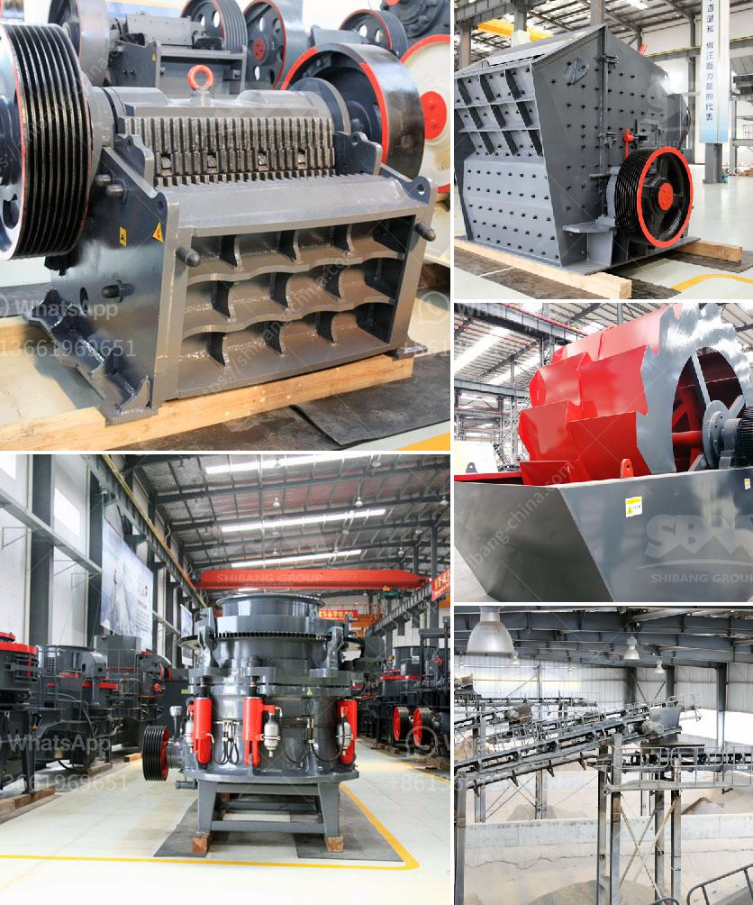

<h3>italy mobile vibrating screen</h3>
The advent of modern technology has revolutionized various industries, enabling them to streamline their processes and enhance overall efficiency. In the realm of material processing, mobile vibrating screens have emerged as a game-changer, allowing for seamless sorting, grading, and separation of materials on the go. Italy, known for its exceptional engineering and innovation, has taken a significant leap forward in this domain with the development of its mobile vibrating screens.

Mobile vibrating screens are highly flexible devices that can be easily transported to different job sites, making them ideal for construction, mining, and recycling industries. These screens are designed to efficiently sort and separate materials of varying sizes, ensuring the highest quality end products. Italy, renowned for its excellence in technological advancements, has introduced mobile vibrating screens that set the industry benchmark in terms of performance, durability, and reliability.

One of the standout features of Italy's mobile vibrating screens is their exceptional versatility. These innovative screens can handle a wide range of materials, from aggregates to compost, sand to gravel, and much more. With customizable deck designs and adjustable screening angles, these mobile screens can adapt to the specific requirements of each application. This versatility empowers businesses to process various materials efficiently, reducing the need for multiple machines and streamlining their operations.

In addition to their adaptability, Italy's mobile vibrating screens boast advanced technological features that optimize processing efficiency. These screens are equipped with high-performance vibrating mechanisms, producing powerful vibrations that separate materials with precision and speed. The adjustable amplitude and frequency settings further enhance the screening process, allowing for optimal performance in different operating conditions.

Moreover, Italy's mobile vibrating screens prioritize ease of use and maintenance. With user-friendly interfaces and intuitive controls, operators can easily adjust screen settings, monitor performance, and diagnose issues. This ensures smooth operation and minimizes downtime, translating into increased productivity and reduced costs.

Furthermore, Italy's commitment to sustainability is evident in its mobile vibrating screens. Designed with energy-efficient components, these screens consume less power while delivering exceptional performance. This not only significantly reduces operational costs but also minimizes the environmental footprint, making them a sustainable solution for the material processing industry.

Italy's mobile vibrating screens have garnered global recognition for their robust construction and reliability. Built with high-quality materials and precision engineering, these screens are designed to withstand the harshest working conditions. Their ruggedness and durability ensure prolonged service life, reducing the need for frequent repairs and replacements.

In conclusion, Italy's mobile vibrating screens have revolutionized the material processing industry, elevating efficiency, versatility, and sustainability to unprecedented levels. With their ability to handle diverse materials, advanced technological features, ease of use and maintenance, and robust construction, these screens have become the go-to solution for construction, mining, and recycling businesses worldwide. As Italian engineering and innovation continue to push boundaries, the future of mobile vibrating screens seems brighter than ever.
<h3>Contact us</h3><ul><li><strong>Whatsapp:&nbsp;<a href="https://wa.me/8613661969651">+8613661969651</a></strong></li><li><a href="https://swt.shibang-china.com/?git&amp;zhl&amp;italy mobile vibrating screen"><strong>Online Service(chat now)</strong></a></li></ul><h3>Related</h3><ul><li><a href='used portable crusher for sale in germany.md'>used portable crusher for sale in germany</a></li><li><a href='mobile crushers for hire in product.md'>mobile crushers for hire in product</a></li><li><a href='stone crusher 80 tons of jam.md'>stone crusher 80 tons of jam</a></li><li><a href='vertical hammer crusher.md'>vertical hammer crusher</a></li><li><a href='manganese processing plant in india.md'>manganese processing plant in india</a></li></ul>