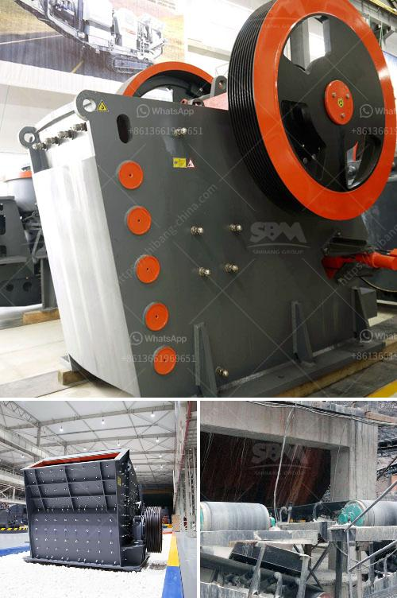

<h3>japan made jaw crushers</h3>
Japan, a country renowned for its technological prowess, continues to be at the forefront of innovative machinery design and production. One prime example of this is the development of jaw crushers – machines that break down large rocks into smaller, more manageable sizes. Japan-made jaw crushers are renowned for their high-quality build, rugged reliability, and ease of maintenance, ensuring that they are ideal for crushing a wide range of materials in various industries.

One of the key factors that differentiate Japan-made jaw crushers is their robust construction. These machines are typically made using heavy-duty materials, such as cast iron, which ensures their durability even under the harshest working conditions. In addition, advanced welding techniques are employed during the manufacturing process, further enhancing the strength and resilience of these crushers. As a result, Japan-made jaw crushers are capable of withstanding heavy loads and frequent impact, making them perfect for quarrying and mining applications.

Another distinguishing feature of Japan-made jaw crushers is their superior performance. These crushers are engineered to deliver high crushing ratios, enabling users to efficiently reduce large rocks into smaller, uniform sizes. The advanced design of the crushing chamber ensures optimal crushing action, resulting in the production of high-quality end products. Furthermore, Japan-made jaw crushers boast a high throughput capacity, enabling operators to process large quantities of material in a short period of time. This makes them an ideal choice for high-production operations.

Maintaining Japan-made jaw crushers is also a straightforward process. Their design incorporates easy access to key components, such as the toggle plate and jaw liners, allowing for quick replacement in case of wear or damage. Additionally, these crushers are equipped with advanced hydraulic systems that facilitate easy adjustment of the crusher settings. This, combined with the use of high-quality bearings, minimizes downtimes and guarantees a long service life.

In conclusion, Japan-made jaw crushers exemplify the country's commitment to excellence in machinery design and production. Their robust construction, superior performance, and ease of maintenance make them indispensable in quarrying and mining operations. Whether it is crushing rock, ore, or other materials, Japan-made jaw crushers deliver unrivaled efficiency and reliability.
<h3>Contact us</h3><ul><li><strong>Whatsapp:&nbsp;<a href="https://wa.me/8613661969651">+8613661969651</a></strong></li><li><a href="https://swt.shibang-china.com/?git&amp;zhl&amp;japan made jaw crushers"><strong>Online Service(chat now)</strong></a></li></ul><h3>Related</h3><ul><li><a href='manganese ore processing machine price.md'>manganese ore processing machine price</a></li><li><a href='used grinding mills for sale.md'>used grinding mills for sale</a></li><li><a href='dolomite process peritidal subtidal.md'>dolomite process peritidal subtidal</a></li><li><a href='modular conveyor belt supplier china.md'>modular conveyor belt supplier china</a></li><li><a href='calcite production plant.md'>calcite production plant</a></li></ul>