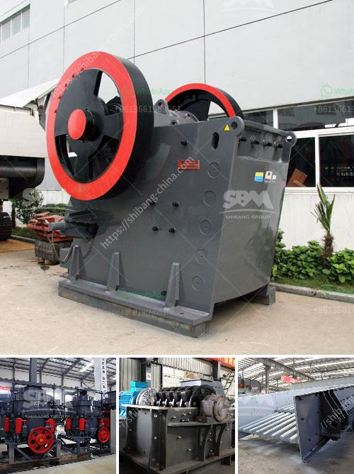

<h3>jaw crusher 400 600</h3>
The jaw crusher 400 600 is one of the most commonly used crushing equipment in the mining industry. It is mainly used for medium-sized crushing of various ores and bulk materials. The maximum compressive strength of the crushed material is 320MPa.

The jaw crusher is a reliable and easy-to-use machine. It is easy to maintain and offers a simple structure that is easy to operate. The machine provides a high crushing ratio, which means that the size of the ore particles can be reduced efficiently.

One of the key features of the jaw crusher 400 600 is its ability to handle hard materials with high compressive strength. This makes it a popular choice for mining and quarrying applications. The machine is also able to perform safely and efficiently in high-temperature and humid conditions, making it suitable for use in any environment.

The jaw crusher 400 600 is designed to ensure optimal crushing performance in all types of conditions. This model is an ideal investment for those seeking to maximize their crushing capacity. The machine is known for its high-quality construction, reliability, and efficiency.

The jaw crusher 400 600 operates using a motor. A belt and pulley system drives the machine, which allows for smooth operation and minimal vibration. This ensures that the crusher runs quietly and efficiently, reducing the risk of damage to other equipment in the vicinity.

The machine is equipped with a feed hopper that allows for easy feeding and prevents spillage. It also features a hydraulic adjustment system, which allows for easy setting of the size of the ore particles to be crushed. This ensures that the final product meets the desired specifications.

In terms of safety, the jaw crusher 400 600 is equipped with a variety of features that protect both the operator and the machine itself. These include a safety latch, which prevents the machine from opening during operation, and a spring-loaded release mechanism, which ensures that the jaw closes and opens smoothly.

The jaw crusher 400 600 is a cost-effective and highly efficient crushing machine that is capable of breaking down a wide range of materials. It is a versatile machine that is suitable for different applications, such as mining, quarrying, and recycling.

In conclusion, the jaw crusher 400 600 is a powerful machine that is widely used in the mining industry. It provides high crushing efficiency, reliable performance, and is easy to operate and maintain. Whether used for primary crushing or secondary crushing, this machine is an excellent choice for any mining project.
<h3>Contact us</h3><ul><li><strong>Whatsapp:&nbsp;<a href="https://wa.me/8613661969651">+8613661969651</a></strong></li><li><a href="https://swt.shibang-china.com/?git&amp;zhl&amp;jaw crusher 400 600"><strong>Online Service(chat now)</strong></a></li></ul><h3>Related</h3><ul><li><a href='gyratory crusher price.md'>gyratory crusher price</a></li><li><a href='quartz stone processing machines.md'>quartz stone processing machines</a></li><li><a href='horizontal impact crusher for sale.md'>horizontal impact crusher for sale</a></li><li><a href='aggregate production line.md'>aggregate production line</a></li><li><a href='mobile stone crusher 120 tph price.md'>mobile stone crusher 120 tph price</a></li></ul>